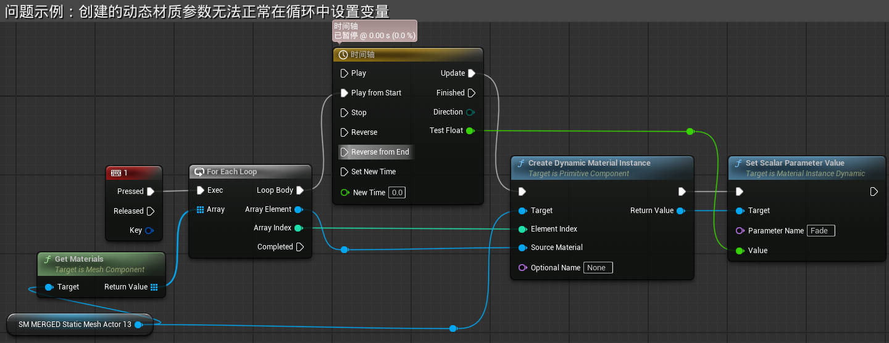
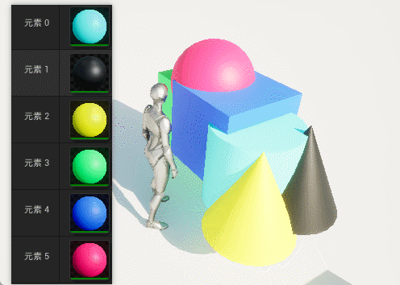
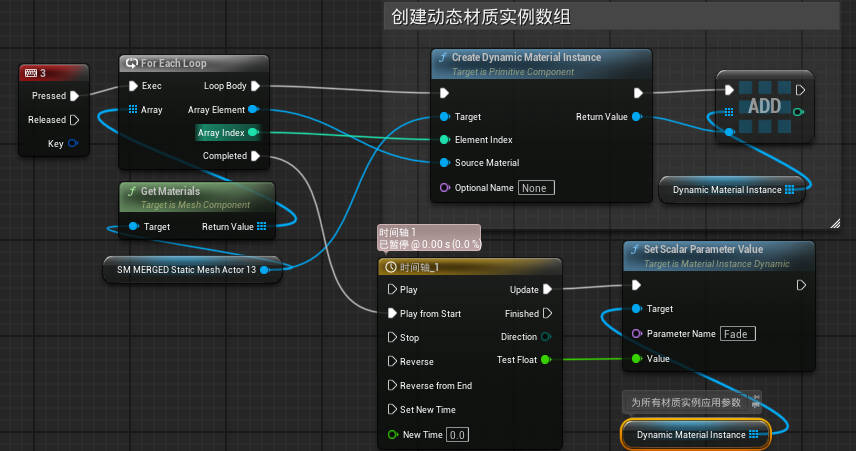
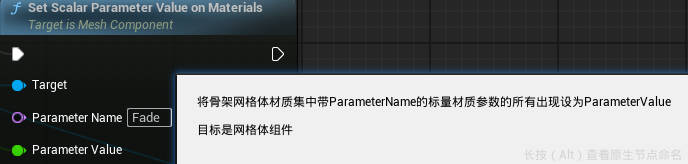
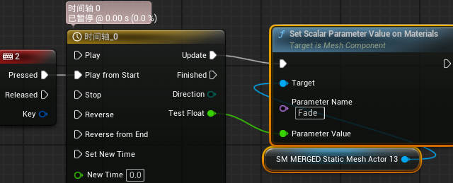

# 概述

现象：在循环中创建多个材质索引的动态材质实例（Create Dynamic Material Instance）后，无法同时修改其材质参数（Set Scalar Parameter Value），只能设置最后一个材质插槽中的材质参数。

解法：将第一个循环创建的动态材质实例作为**数组变量**保存，并在循环结束后设置材质参数。

更好的解法：使用 `Set Scalar Parameter Value on Materials | 在材质上设置标量参数值` 节点；这个节点会设置**网格体组件**上所有的指定名称的材质参数。

# 背景

制作“完美闪避”效果时，让保持在原地的模型逐渐消失时，需要将参数传递到材质。但是人物模型上有多个材质插槽，且难以使用材质参数集，故想要使用 `Set Scalar Parameter Value | 设置标量参数` 。但在使用时出现问题，只会影响最后一个插槽中的材质。

---

# 问题示例

使用材质参数集，会导致本体同样消失（还没研究更多方法）；故使用动态材质实例，通过循环，获取模型上不同材质索引的材质，创建材质实例，并使用 `Set Scalar Parameter Value | 设置标量参数` 设置参数，让材质逐渐消失。

如上图，运行后只会影响最后一个材质插槽中的材质。

# 解决方法

> 现有解决方法，再反推问题原因，所以不知道下面的原因是否正确。
>
> 感谢@[粗学者小白](https://space.bilibili.com/641892012)提供的思路

将 `Create Dynamic Material Instance | 创建动态材质实例` 的输出提升为材质，并将类型设置为数组，并将所有循环中创建的值添加到这个数组中。

循环结束后，已经获取了所有材质实例，此时可以正常应用材质实例的参数。

# 原因猜测

在循环中，创建的动态材质实例会被下一个动态材质实例覆盖，所以需要将所有动态材质实例作为数组保存下来。

# 更好的解法

使用 `Set Scalar Parameter Value on Materlals | 在材质上设置标量参数值` 节点。

这个节点可以直接影响网格体组件中所有与Parameter Name参数值相同的变量，无需任何遍历操作。