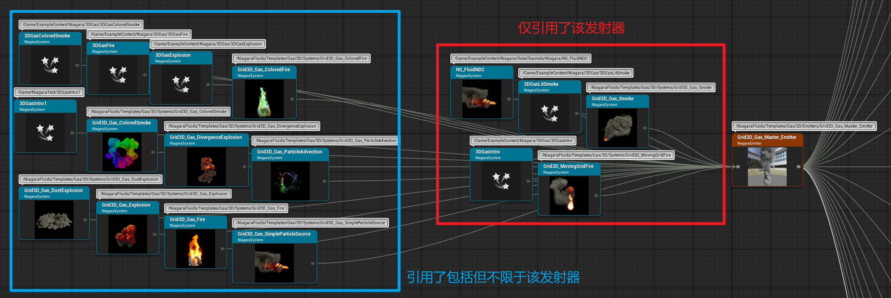
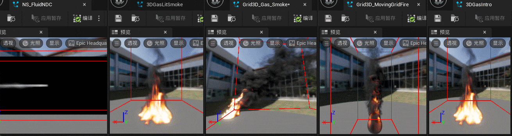

> unreal版本：5.5.4
>
> 内容示例安装时间：2025年3月4日

# 概述

`Grid3D_Gas_Master_Emitter` 是内容示例中的一个基础发射器，是众多Niagara系统的基础构成；也是　`Fluid Gas | 流体气体` 的实现基础

# 引用链接
- 官方Niagara流体文档：[Niagara流体快速入门指南](https://dev.epicgames.com/documentation/zh-cn/unreal-engine/niagara-fluids-quick-start-guide-for-unreal-engine)
- 很详细，同时介绍了更多示例粒子内容：[UE5 Niagara Fluid Gas 速读](https://zhuanlan.zhihu.com/p/692194304)

## 虚幻内容示例
- 虚幻内容示例官方文档：[内容示例](https://dev.epicgames.com/documentation/zh-cn/unreal-engine/content-examples-sample-project-for-unreal-engine)
- Fab下载页面：[Content Examples](https://www.fab.com/listings/4d251261-d98c-48e2-baee-8f4e47c67091)