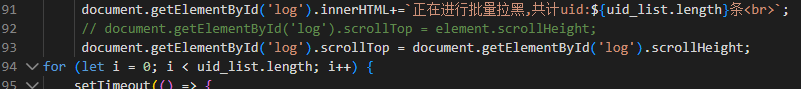
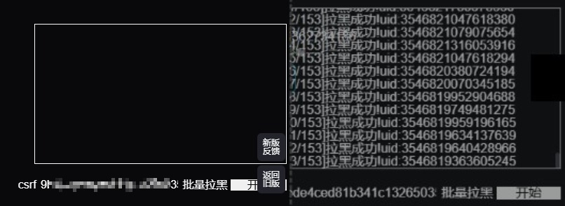
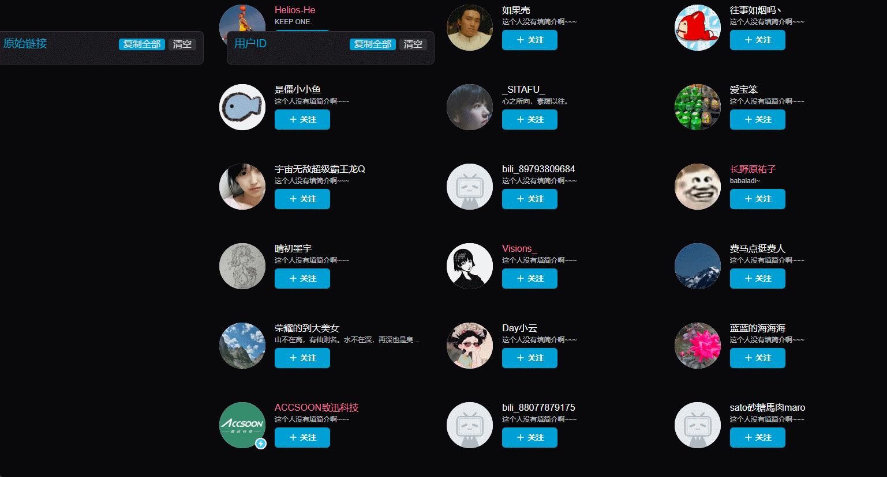
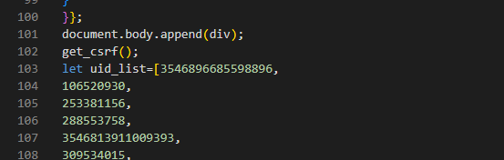

# 核心框架

目的：尽可能解决B站机器人账号关注、骚扰问题

原因：
1. 机器人账号会有组织的扰乱直播间等正常行为
2. 机器人账号可能会进行批量举报，影响账号正常使用
3. ~~电子洁癖~~

方法：使用js脚本，批量拉黑问题账户（参见“解决办法”部分）

- 核心是“批量拉黑”和“获取BUID”两个脚本的配合使用

内容包括：
- 近期现象
- 如何操作批量脚本
- 如何快速获取关注自己的B站伪人账号BUID

## 现象描述

最近B站上出现了大规模“伪人账号”，人称片姐。但可能片姐只是一个身份幌子，实际为赛博阴兵。
典型特征是：
- 昵称：默称或乱写（随机词汇或字母）
- 简介：没有或很……emmm，诱惑
- 等级：Lv1及以下
- 主页：没有投稿和浏览记录
- 大量关注别人

比如：


当你在评论区活跃时，就会被莫名其妙的关注，现在基本上各大UP的关注列表中，只要点进去就会有。

## 影响

对于普通用户，这些似乎没什么影响；对于UP主等可能发表意见的群体，这些机器人就可能有组织的冲击直播间、批量举报等，导致影响正常活动甚至封号。

## 解决办法

> PS：可能……并不是很有用。

**批量拉黑对应的账号**

原理：使用js脚本，通过一个记录伪人账号的表单，对表单中的账号执行批量拉黑操作。

### 操作步骤

#### 一、安装运行环境

> 点击链接，进入就是下载或对应操作的网站

1. 使用兼容的浏览器
   1. 推荐[edge](https://www.microsoft.com/en-us/edge/download?form=MA13RE?ocid=ORSEARCH_Bing)、[Chrome](https://support.google.com/chrome/answer/95346?hl=zh-Hans&co=GENIE.Platform%3DDesktop)。
2. 接下来以edge为例：
   1. 进入[edge扩展市场](https://microsoftedge.microsoft.com/addons/Microsoft-Edge-Extensions-Home)
   2. 安装脚本运行插件：推荐[脚本猫](https://microsoftedge.microsoft.com/addons/detail/%E8%84%9A%E6%9C%AC%E7%8C%AB/liilgpjgabokdklappibcjfablkpcekh)或者[油猴](https://microsoftedge.microsoft.com/addons/detail/%E7%AF%A1%E6%94%B9%E7%8C%B4/iikmkjmpaadaobahmlepeloendndfphd)

#### 二、脚本操作

1. 安装批量拉黑脚本[BlackList_Sniffer](https://scriptcat.org/zh-CN/script-show-page/2477/)
2. 在[脚本控制面板](extension://liilgpjgabokdklappibcjfablkpcekh/src/options.html)中，确保BlackList_Sniffer脚本运行
3. 点击进入编辑，修复其中bug：将92行内容替换成下面的内容
   1. ```JavaScript
        document.getElementById('log').scrollTop = document.getElementById('log').scrollHeight;
        ```
   2. 
4. 登录B站，进入主页
5. 点击批量拉黑按钮，运行脚本


#### 三、更多操作

获取更多BUID：【腾讯文档】B站片姐列表（方便拉黑）
https://docs.qq.com/sheet/DTmRTZlhweVFzR0Rm?tab=BB08J2

## 快速获取关注自己的B站账号BUID

安装并运行[BUID获取助手](https://scriptcat.org/zh-CN/script-show-page/3417)

进入主页后，点击需要拉黑的用户名单，即可获取其主页链接和BUID



### 向批量拉黑脚本中添加自定义BUID

选好后，使用带逗号复制功能。

打开BlackList_Sniffer脚本代码页面，找到下面的UID列表：



将列表内容删除（注意不要删除两侧的方括号），并粘贴刚刚复制的内容即可。

此时运行脚本，会拉黑刚刚输入的内容。
