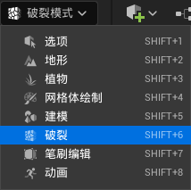
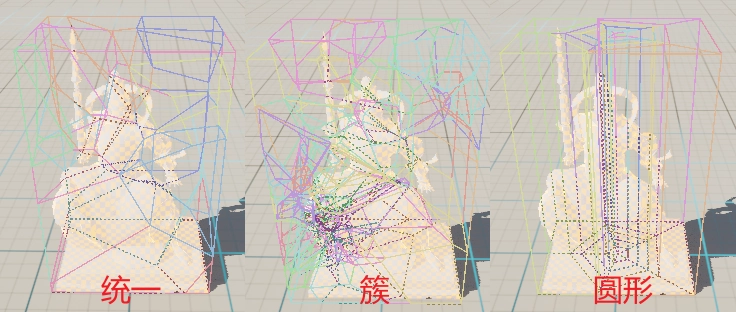
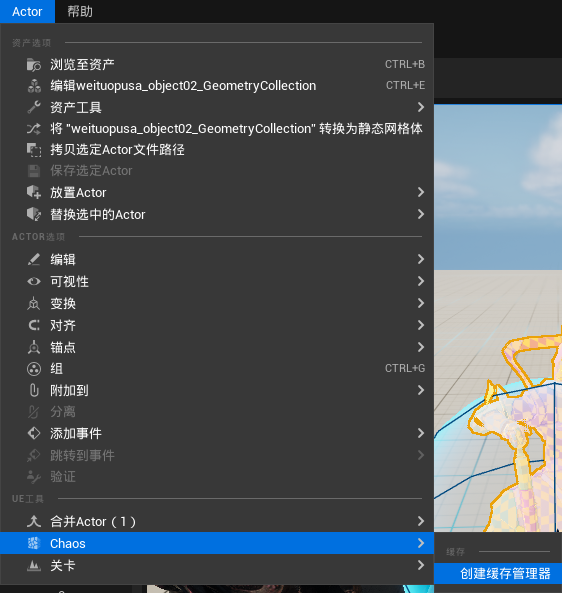

> UE 版本：5.3.2

# 使用 Chaos 的前提

> 这些插件在 5.3 中均默认启用

启用以下插件：
- Chaos Solver
- Chaos Editor
- Chaos Caching

# Chaos 系统构成
系统中涉及到很多组件，这里相对直观的介绍一下各个部分的作用：
.webp)
- Geometry Collection | 几何体集：记录破碎的结果，即：碎成多少块，以什么样的方式碎开。
- field 场蓝图：以 field 结尾的几个蓝图，用来对破碎结果施加影响
	1. BP_MasterField：施加一个 **爆开** 的力
	2. BP_AnchorField：锚点，冻结被框住的部分
	3. BP_SleepField：冻结完全包裹住的模型，直到受到力的作用
- Chaos Cache Manager | 混沌缓存管理器：将破碎后受力产生的动画录制成缓存，以减少实时计算的压力。
- Chaos Cache Collection | 混沌缓存集合：Manager 录制的结果，缓存动画本身。

# 创建一个破碎
## 进入破碎模式

## 新建破碎对象
.webp)
此时会让你选择 `Geometry Collection | 几何体集` 的储存位置：
.webp)

## 创建破碎结果
使用 Fracture | 破裂 分组中的选项，创建破碎结果：
.webp)

选择完成后，点击破裂生成结果：
.webp)

## 添加力
静止的物体不会破碎，想让物体破碎需要让物体受力，比如从高处落下：

> tips：
> 
> 1. 显示物体原本材质：取消勾选细节面板中的 显示骨骼颜色.webp)
> 
> 2. 受到多大的力才碎开，受到伤害阈值的控制.webp)

这里使用 field 场蓝图对物体添加力，这里添加一个 BP_MasterField 爆开的力：
.webp)
这是一个球状蓝图，会给物体一个向外爆开的力：
.webp)

## 烘焙破碎动画缓存
创建离线缓存

这个操作会创建两个对象：
1. （场景中）Chaos Cache Manager | 混沌缓存管理器：录制工具
2. （内容管理器中）Chaos Cache Collection | 混沌缓存集合：缓存储存对象

> 注意！：
> 
> 录制会基于 `Chaos Cache Manager | 混沌缓存管理器` 录制工具相对位置记录动画，可以将 `Geometry Collection | 几何体集` 放置到录制工具的子集，然后归零坐标.webp)

此时缓存模式默认为 “录制”：
.webp)
运行游戏后，会将模拟结果写入 `Chaos Cache Collection | 混沌缓存集合` 。录制后，将缓存集合拖入地图中，运行后即可播放缓存。

