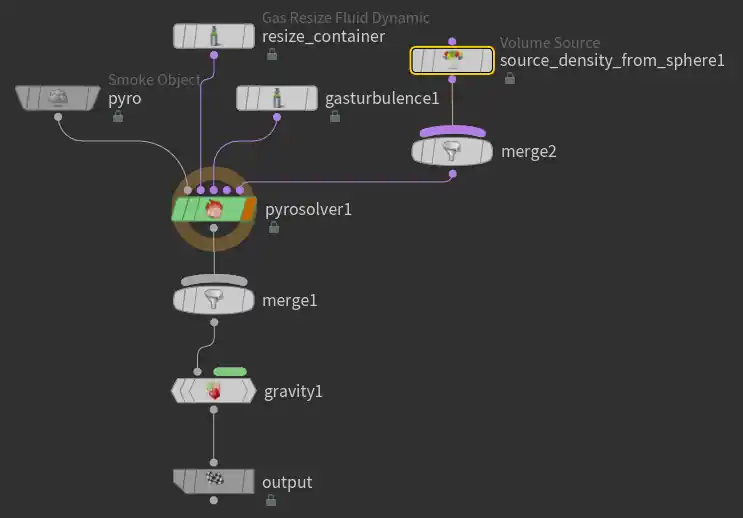

> Houdini 版本：20.5.278
>
> SideFXLabs 版本：20.5.253
>
> HoudiniEngineForUnreal 版本：2.2.0
> 
> unreal版本：5.4.4
# Houdini Niagara 插件概述
通过 Houdini Niagara 插件，可以将模拟结果导出为“带属性的点”，并在 Niagara 中作为 particle 等渲染。

# 笔记概述
基于 Houdini 官方演示，记录 Houdini Niagara 插件使用方法的同时，对 POP 粒子进行简单学习。

基于官方案例：
- 官方YouTube：[Houdini to Niagara | Pt1 | Particles](https://www.youtube.com/watch?v=GAn1Za1MYW4&list=PLiLTp4nDly58l1kFIAWTWwYxLu5GUhsRA)
- 官方案例及下载：[Realtime FX with Niagara | UE4 | SideFX](https://www.sidefx.com/tutorials/realtime-fx-with-niagara-ue4/)


# 在 Niagara 中读取和使用模拟结果

> Houdini 部分放在后面
## 读取 hbjson 文件

正确[安装好 Houdini Niagara 插件](https://youli42.github.io/posts/Houdini%E6%B3%B0%E5%9D%A6%E8%AE%A1%E5%88%92%EF%BC%9A%E4%B8%80%E3%80%81%E7%94%B5%E7%BC%8602%EF%BC%88%E6%95%B0%E5%AD%97%E8%B5%84%E4%BA%A7%E4%B8%8E%E8%81%94%E5%8A%A8UE%EF%BC%89/#:~:text=%E7%9A%84%E4%B8%80%E4%BA%9B%E7%89%B9%E6%80%A7-,%E4%B8%80%E3%80%81%E5%AE%89%E8%A3%85%20Houdini%20Engine%20for%20Unreal,-%E7%9C%81%E6%B5%81)后，将 hbjson 文件导入：


创建一个基本模板：


将导入的 hbjson 放入指定位置：

为了方便管理，也可也在用户参数中创建数据接口：Niagara Data Interface Houdini，并赋予上面三个位置。


此时可以看到 Niagara 中的粒子按照 Houdini 模拟粒子结果移动：

## 读取颜色数据
- 储存位置：STACKCONTEXT HOUDINI Color
- 数据类型：Vector
在 Niagara 中应用需要添加 Color 属性，应用 STACKCONTEXT HOUDINI Color。


# 官方 POP 案例项目
对官方案例文件：`Volume_to_Particles.hip`的解析。


## 1、Geometry：sphere1
通过球体，生成基础 VDB。

### 【**Pyro Scurce** | 火焰源】
作用：从模型创建点，并为点添加属性，以便进行火焰或烟雾模拟。

常用参数：
- **Initialize | 初始化**：根据所选预设配置节点，这些属性可以通过 Volume Source 节点使用混合操作导入。这里使用以下预设：
	- Source Smoke：烟雾/水汽等。使用属性：`density` 密度、`temperature` 温度。
- **Particle Separation | 粒子密度**：控制粒子数量；数字越小，粒子越多。
### 【Volume Rasterize Attributes | 体素栅格化的属性设置】
作用：根据点云的属性，创建 VDB

> VDB（OpenVDB）是一种​**​高效存储稀疏体积数据​**​（如烟雾、火焰、云）的​**​开源数据结构​**​。它将三维空间划分为体素（voxel），但仅存储非空区域，大幅减少内存和计算开销。其核心特点包括：
> 
> 1. ​**​稀疏性​**​：忽略空白区域，体积更小、处理更快；
> 2. ​**​动态树结构​**​：基于分层B+树（根节点稀疏，子节点稠密），支持快速随机访问和拓扑变化；
> 3. ​**​多用途​**​：可存储密度（如烟雾）、距离场（SDF）、速度场等，广泛用于特效模拟与渲染。


常用参数：
- **Attributes | 属性**：使用哪些属性作为创建 VDB 的基础（这里生效的似乎只有 density 和 temperature）
- **Voxel Size | 体素大小**：就是体素的分辨率，这里使用了 HScript 生成
- **Normalize by Clamped Coverage | 基于钳制后的覆盖范围进行规范化处理**：启用此选项会将采样的体积乘以覆盖率，从而在由粒子覆盖的区域之间产生平滑过渡。

#### 在 HScript 中获取参数值
关于 Voxel Siex | 体素大小中的 HScript 代码：
```C
ch("/obj/sphere1/create_density/particlesep") * ch("/obj/sphere1/create_density/particlescale") / 4
```
即：使用上面的 Volume Rasterize Attributes 节点中的 Particle Separation 和 Particle Scale 的值进行计算。

具体变量名称可以用以下方法获取：
1. 右键 Copy Parameter （复制参数），并在目标处 Paste Absolute References （粘贴绝对引用）
2. 鼠标悬停，查看提示
3. 打开目标节点的 edit parameter interface 界面看

> 快速删除引用：Ctrl + Shift + LMB

## 2、DOP Network：AutoDopNetwork
模拟的完整过程将在这里进行，这里运行一个简单的烟雾模拟，并不会太深入的解释。

### 【Volume Source | 体积源】
在这里，引用了 Geometry：sphere1 中生成的 VDB。

### 【Pyro Solver | 火焰解算器】
根据设置的数据，对 VDB 进行模拟

## Geometry：pyro_import

使用模拟结果和一个网格体生成点云

重点是其中的 DOP Network：popnet：

- 【**这是重点**】：将 VDB 模拟结果转化成点云（粒子），并输出为 Hbjson 文件。
- 前提：安装 SideFXLabs 功能包。

### 【POP Source | 动力学源】
作用：从几何体发射粒子

重要参数：
- Source | 源：
	- Emission Type | 发射类型：从聚合体源中如何反射粒子
		- Scatter onto Surfaces | 散射到表面：从几何体表面发射
- Birth | 生成：
	- Const. Activation | 常量激活：是否开启发射；为“0”时开启，其他值时关闭。这里在 28 帧前都开启。
### 【POP Advect by Volumes | 体积驱动的 POP 流送】
通过流体模拟的结果驱动 POP 粒子，会修改 `force` 、 `vel` 和 `P` 属性。

重要参数：
- Velocity Source | 速度源：速度的来源，Context（上下文）指的是此 DOP 网络的输入。这里使用 Second Context Geometry 即：popnet 节点的第二个输入。
- Advection Type | 平流类型：平流，即流体随整体移动而产生的移动过程，这里意为根据外部速度场更新粒子系统。
	- Update Force | 更新力：会根据​​力强度比例 (force scale)​​ 和​​速度场 (velocity field)​​ 调整粒子的​​加速度 (acceleration)​​。其作用类似于 ​​Force POP (力粒子操作器)​​。
	- Update Velocity | 更新速度：通过将速度场​​混合/融合进去 (blending in)​​，直接改变粒子的​​速度 (velocity)​​，使粒子能迅速匹配速度场。
	- Update Position | 更新位置： 直接​​移动 (moves)​​ 粒子的​​位置 (position)​​。这很有用，因为它允许粒子的​​自身速度 (own velocity)​​ 能够独立于​​整体流体速度 (bulk fluid velocity)​​ 进行考虑。位置更新类似于 ​​Gas Advect DOP (气体平流动力学操作器)​​ 所执行的操作。

### 【POP Color | 粒子颜色】

使用Ramp，将颜色变化通过曲线与寿命绑定。
### 【POP Object | POP对象】

用来调整粒子属性，如弹力、摩擦力等，这里将：Physical - Friction 摩擦力设置为  “0”

### 【Labs Niagara ROP】
ROP 即：Render Out Put

Niagara ROP 将静态或动画点缓存导出为 Houdini Niagara Unreal 插件可以读取的自定义 JSON 格式（.hbjson 文件）。这可用于驱动 Niagara 中的粒子发射器，或在 Houdini 中创建可在 Niagara 中实时运行的复杂模拟。

点击 Render 即可将模拟结果作为点数据导出到 .hbjson 文件中。

