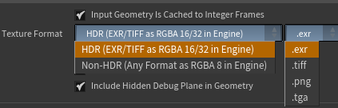
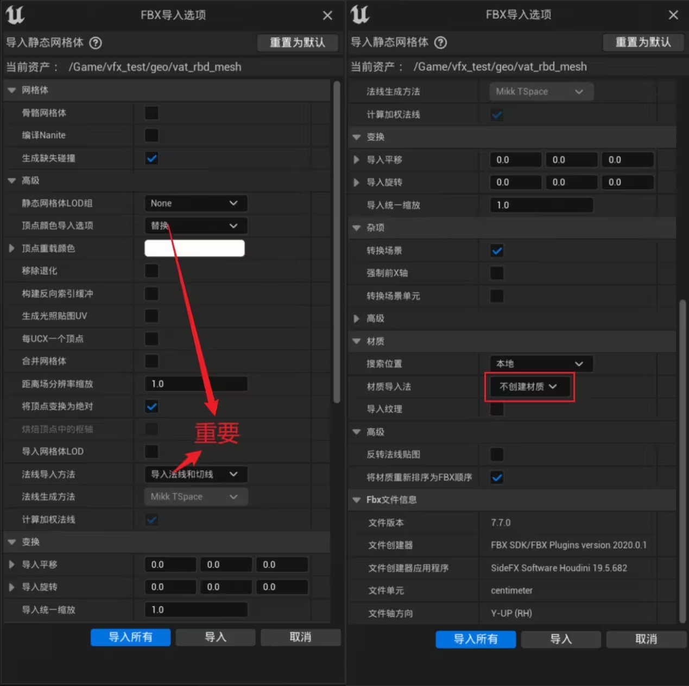

> Houdini 版本：20.5.278
>
> SideFXLabs 版本：20.5.253
>
> HoudiniEngineForUnreal 版本：2.2.0
>
> unreal版本：5.4.4
# 目的
对已有模型添加轻微飘动的动画，具体来说：

|  |  |
| ------------------------------- | ------------------------------- |
> 一开始以为是飘动，要风模拟，后来才知道不需要，只是简单的动画。但也涉及到很多新领域，故记录一下。
> 
>同时，也会包含一些模拟方面的探索。

最终效果示例：

# 涉及核心知识点
1. 模型处理：删除 UE 导出后生成的外包围框的三种方法。
2. 动画部分
    1. Soft Transform | 软选择：相比其它建模软件更灵活的工具
    2. Motion FX | 运动特效：通过曲线控制节点参数
2. 动画导出到 UE
3. 模拟部分
    1. 在模拟中“冻结”部分
# 模型处理
UE导出模型时，会添加一个外包围框，希望有一个程序化的方式，可以用一定条件，自动删除这个多余部分。

## 根据属性删除
 > 这个场景下的最优选择。
 
UE会给外包围框添加独立属性，即：Primitives 层级的 name 属性值为：“UCX_【模型名称】”的部分，为包围框。

接着，使用 Blast 指定删除外包围框即可。指定值删除可以在 Blast 节点的 Group 属性中填写以下 HScript 代码：
```C
@name="UCX_guofengchangjing_Painting_002_1"
```

> 数据可视化可以参考：[自定义属性可视化](https://youli42.github.io/posts/Houdini%E6%B3%B0%E5%9D%A6%E8%AE%A1%E5%88%92%EF%BC%9A%E4%BA%8C%E3%80%81%E6%95%A3%E5%B8%83%E5%B7%A5%E5%85%B7/#5%E3%80%81%E8%87%AA%E5%AE%9A%E4%B9%89%E5%B1%9E%E6%80%A7%E5%8F%AF%E8%A7%86%E5%8C%96:~:text=%E8%AF%86%E5%88%AB%E7%9A%84%E5%90%8D%E7%A7%B0%E3%80%82-,5%E3%80%81%E8%87%AA%E5%AE%9A%E4%B9%89%E5%B1%9E%E6%80%A7%E5%8F%AF%E8%A7%86%E5%8C%96,-%E5%B1%9E%E6%80%A7%E5%8F%AF%E8%A7%86)
> 
> UCX：即：Unreal Collision，虚幻碰撞体。

## Connectivity 创建删除组
> 很怪的解法，但是万一有用呢？

- 背景知识：Connectivity 节点基于顶点索引，从小到大添加唯一整数序号。
- 虚幻特性：添加的外包围框索引序号最大，所以 Connectivity 节点产生的序号也最大。
- 解法：删除 Class 中最大的部分，类似这个解法：[找出最高的几个面片](https://youli42.github.io/posts/Houdini%E6%B3%B0%E5%9D%A6%E8%AE%A1%E5%88%92%EF%BC%9A%E4%BA%8C%E3%80%81%E6%95%A3%E5%B8%83%E5%B7%A5%E5%85%B7/#:~:text=%E5%9C%A8%20Blast%20%E8%8A%82%E7%82%B9%E7%9A%84%20Group%20%E5%8F%82%E6%95%B0%E4%B8%AD%EF%BC%8C%E4%BD%BF%E7%94%A8%20HScript%20%E8%84%9A%E6%9C%AC%EF%BC%8C%E6%89%BE%E5%87%BA%E9%AB%98%E5%BA%A6%20y%20%E4%B8%8E%E6%9C%80%E5%A4%A7%E5%80%BC%E7%9B%B8%E5%90%8C%E7%9A%84%E9%9D%A2%E7%89%87%EF%BC%8C%E5%B9%B6%E5%88%A0%E9%99%A4%E5%85%B6%E4%BB%96%E9%83%A8%E5%88%86%EF%BC%9A) 
    1. Connectivity 节点，为每个拓扑完整的模型分配唯一序号，默认储存在属性 class 中。
    2. Attribute Promote 属性提升，将 class 属性中最大的值存储到 detail 层级
    3. Attribute Transfer 属性转移，还原 Primitives 中记录的 class 值。
    4. Blast 通过比对属性，删除序号最大的部分，也就是包围框。Group 参数中的 HScript 如下：
```C
@class=`detail(0,"MaxClass",0)`
```


## Winding Number 选择删除部分

此时，`winding_number <= 0` 的部分就是法线向内，即包围盒部分。

# 动画部分
基本思路：通过软变换选择，使用 Motion FX 创建循环动画
## Soft Transform 软变换
快速理解：其他软件 “软选择 + 变换“ 操作的结合，可以对变换进行更灵活的调整。

核心参数：
- Group | 组：选择从哪些点开始，是控制的基础
- Translation部分：控制变换
- Soft Radius | 软半径：控制软选择范围

## Motion FX 运动特效
快速理解：通过曲线控制节点的参数
### 启用曲线
右键要控制的参数：Reference - 【选择使用的模式】

### 调整参数
#### 基本调整
选择基本类型后，可以在**弹出窗口**中控制参数细节：
- 上方：细节参数
- 下方：曲线示例，参数会根据曲线变化而变化

#### 进阶调整
右键参数，跳转到 Motion FX 节点内部：

在内部可以对参数进行细致调整：Houdini 提供了控制节点

同时可以打开 New Pane Tab Type - Views - Motion FX View 面板，查看对应曲线预览。

### 禁用曲线控制
取消勾选右键菜单 - Reference - Enable Effect

# 动画导入 Unreal
两种方法：**.abc** 格式 和 **VAT 顶点动画贴图**。
## .abc 导入动画
几何体缓存，一种常用的动画保存方式。

默认仅导出当前帧，需要修改为：Valid Frame Range - Render Frame Range （有效帧范围 - 渲染帧范围）

其他属性基本默认即可

## 使用 VAT 将动画导入虚幻
VAT，即 Vertex Animation Texture ，顶点动画贴图。将顶点变化记录在一张贴图上，是一种轻量化的动画解决方案。

Houdini 不仅支持导出，同时为不同的引擎（Unreal、unity）提供了方便使用 VAT 的插件。

参考链接：[houdini中各类型通过vat顶点动画导入ue - 哔哩哔哩](https://www.bilibili.com/opus/899760034679881732) 
### Houdini导出处理
在 out 网络面板中，使用 `Labs Vertex Animation Textures` 节点进行导出，这是一个 SideFXLabs 扩展节点。

#### 参数配置

基础配置：
- Mode /Target Engine | 模式/目标引擎：配置VAT类型
    - Mode 包含：刚体、流体、布料、粒子

Settings 设置：
- Input Geometryls cached to Integer Frames：如何有做缓存就勾选，否则不勾。
- All Modes - Texture Format：图片格式，选择导出的 VAT 图片格式。
- 
Input 设置：查看输入属性
- Required | 必要属性：P、pivot、orient
Export 设置：
- 配置输出位置、名称、包含内容
- 
#### 输出 VAT
点击上面的 Render All 按钮即可，最后输出的是两个文件夹，需要全部导入 UE。

### Unreal 配置
#### 1、安装插件
在 Houdini 的 Labs Vertex Animation Textures 节点中的 Real-Time Shaders 选项卡中，打开 Unreal Engine content Plugin and Guides（Unreal Engine 内容插件和指南）

打开后会显示各个引擎版本的插件，将内部的对应文件夹移动到项目目录下的 Plgins 目录（与 Content 文件夹同级）中，然后启用即可。
#### 2、导入 VAT
就是上面生成的两个文件夹，全部导入UE

然后需要对图片执行蓝图脚本操作，执行类型需要和选择的贴图格式一致：

这些脚本会自动调整贴图到正确的采样方式等。同时，最好打开图片一次，或使用其他方法，**刷新引擎，让贴图改动生效**。

#### 3、配置材质

- 取消勾选：切线空间法线
- 创建自定义 UV 数：与插件提供的 UV 接口数量一致

#### 4、创建材质实例，引用 VAT 图

如果需要在sequence里面k帧 需要把auto playback选项后面勾去掉，然后display frame上面k的曲线一定是线性(linear)
# 模拟部分
## 冻结部分模型
让模型一部分，参与整体模拟，但是这部分模型本身不模拟。

具体来说：希望模型最下面卷起来的部分，参与模拟，但是不要散开：

### 解决办法
使用 Vellum Constraints节点的 Constraint Type - Shape Match （约束类型 - 形状匹配）配置，锁定末端形状。

参考教程：[028_shapematch形状匹配_黑白纹理的Discovering Vellum笔记_哔哩哔哩_bilibili](https://www.bilibili.com/video/BV1ou411876f/?vd_source=f92a2f3367b863030638e1aca838fb57)

# 遗留问题
1. Winding Number 节点的使用细节
2. 模拟部分
    1. 风的自定义使用方法
    2. 可控