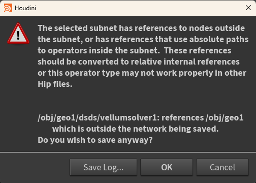
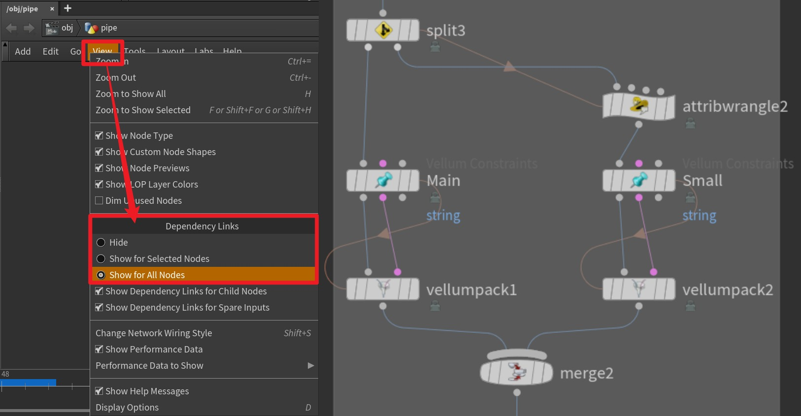
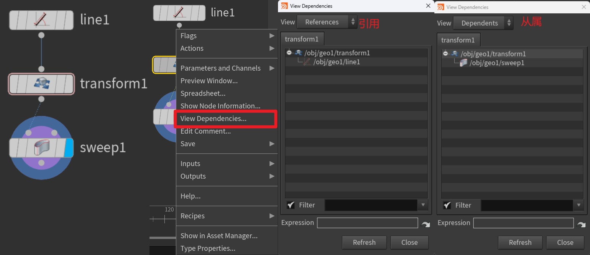
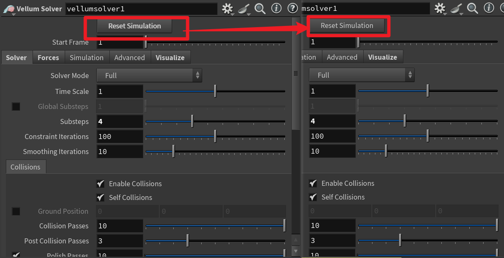
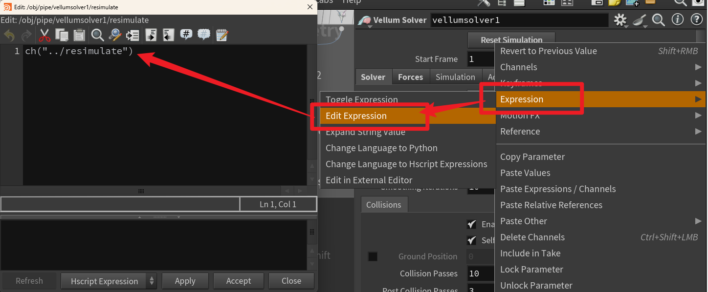

记录一次查找意外引用的过程



# 背景概述
问题：在打包时出现以下错误：
```
The selected subnet has references to nodes outside the subnet,or hasreferences that use absolute paths to operators inside the subnet. These references should be converted to relativeinternalreferences or this operator type may not work properly in other Hip files.
```
报错原因：内部节点中引用了外部节点的参数

# 查找引用

## 省流
通过以下方法查看、寻找和排除引用关系：
- Network View | 节点面板 -> Dependency Links | 依赖关系链
- 右键节点 -> View Dependencies... | 查看依赖项
- 部分打包，排除出出问题的部分
- 手动排除：被修改过参数的名称字体会被加粗
  
附带：查看影响参数的具体表达式的方法

## 查看依赖关系

通过**节点面板 -> View | 视图 -> Dependency Links | 依赖关系链接**选项，可视化节点间的依赖关系



> 官方文档解释：
> 
> - References to other nodes in the same network appear as pinkish-brown lines connecting nodes. Reference lines to a node enter the node on the left. Reference lines from a node leave from the right side of the node.
在同一网络中的其他节点的引用以粉棕色线条连接节点显示。引用线进入节点的左侧，从节点的右侧离开。
> 
> - References to nodes in other networks appear as clickable indicators showing incoming and outgoing reference counts. Click one of the indicators to open a menu that lets you jump to the referenced/referencing nodes.
在其他网络中的节点的引用以可点击的指示器显示，显示入站和出站引用计数。点击其中一个指示器可以打开一个菜单，让您跳转到被引用的/引用该节点的节点。

## 查看依赖项
通过**右键节点 -> View Dependencies... | 查看依赖项**查看节点依赖关系列表：



> 关于现实细节：
>
> Houdini color-codes the parameter name in the dialog:
Houdini 会用颜色标记对话框中的参数名称：
> 
> - Black (normal)   黑色（正常）
> 
>   - 参数被引用/依赖。
> 
> - Grey   灰色
> 
>   - 模糊。参数可能被依赖，但依赖检查不够精细，无法确定。例如，依赖检查工作在参数级别，所以 Houdini 可能会看到对 Translate 参数的依赖，但不知道依赖是在 tx ， ty ，还是 tz （或者是这三个中的所有）。
> 
> - Red   红色
> 
>   - 循环引用。这个节点引用了另一个节点上的参数，而那个节点又引用了这个节点。
> 
> - Yellow   黄色
> 
>   - 循环引用模糊。


## 部分打包排除
将报错的部分选中一半，执行打包，如果没有报错，就打包另一半；如果报错了，就选择其中的一半进行打包，以此类推。

就是使用二分法，或别的任何方法，对出错的节点进行排除，进而确定问题节点。

## 手动排除
参数被外部引用修改后，字体会加粗：



然后删除即可（右键删除或ctrl + shift + LMB）

可以通过 **查看表达式** 看到具体引用：



# 碎碎念
一般来说，使用前两个方法足够应付大部分情况，这里产生这个错误的原因是，打包成数字资产后，资产出错，于是我将其从 subnet 中复制出来，并删除 subnet 。

复制操作后，我在删除数字资产中创建的参数时，忘记将该按钮的引用删除，导致其引用了一个不存在的节点，大大增加了排查难度。