> Houdini 版本：20.5.278
> 
> SideFXLabs 版本：20.5.253

# 开篇：泰坦计划
这个笔记是泰坦计划的学习记录，这里是第一章节**电缆**的基本资产内容制作笔记，对应视频的第一章，1、2、3、部分的内容。

泰坦计划是Houdini官方推出的、上千艺术家参与的开放项目；内容包含Houdini以及联动UE的方方面面。

- Houdini官方介绍：[Project Titan | SideFX](https://www.sidefx.com/titan/)
- UE新闻：[“泰坦计划”示例游戏现已推出：探索这个巨大的开放世界](https://www.unrealengine.com/zh-CN/news/the-project-titan-sample-game-is-now-available-explore-this-huge-open-world)

# 第一部分：电缆
制作目标
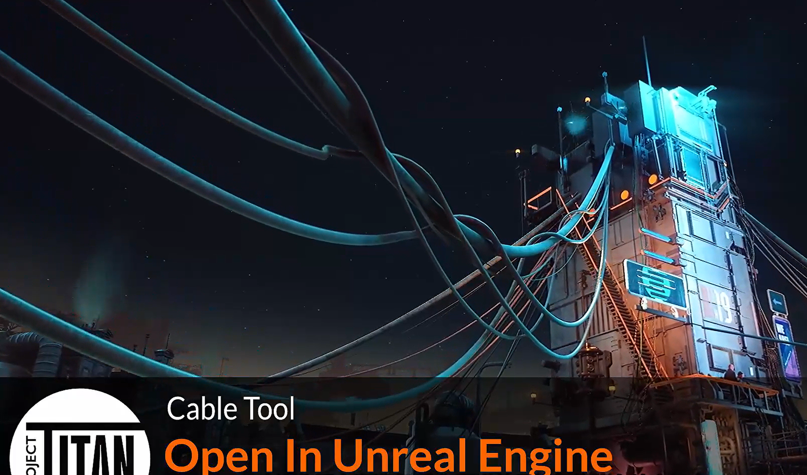
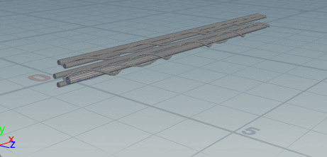

# 省流

- 基于一根 `line | 线` 通过 `sweep | 扫描` 节点生成主体电缆的基础；
- 然后再次扫描，生成更细小的装饰性电缆；
- 接着通过模拟呈现自然下垂的效果；
- 最后清理多余的点，减少消耗。

# 重要知识点：

1. **自动处理间距，避免生成的主电缆重叠**：使用 `Connect Adjacent Pieces | 连接相邻部分` ，获取电缆之间的间距，将其赋予 `pscale` 属性。
2. **自定义Vex代码调整**
   1. 删除小于一定大小的主电缆
   2. 手动调整 `pscale` 缩放
3. 生成随机次要电缆
   1. 随机选择主电缆：`Labs Random Selection` 随机选择。
   2. 生成环绕的次要电缆：使用 `foreach` 循环创建次要电缆。
   3. 随机次要电缆大小：通过备用输入获取循环次数，作为随机种子。
4. `Vellum Constraints | 布料约束` 模拟相关
5. **模型优化**：
   1. `Subdivide | 几何细分节点`：平滑模拟结果。
   2. `Facet | 面片节点`：不影响形状的前提下减少顶点。
   3. 使用不同的扫描参数，减少次要电缆顶点消耗
6. 通过switch切换模拟状态。

# 制作讲解

## 基本部分

按照节点运行流程来写：

1. 主电缆
2. 次要电缆
3. 模拟
4. 优化

## 一、创建主电缆

**自动处理间距，避免生成的主电缆重叠**
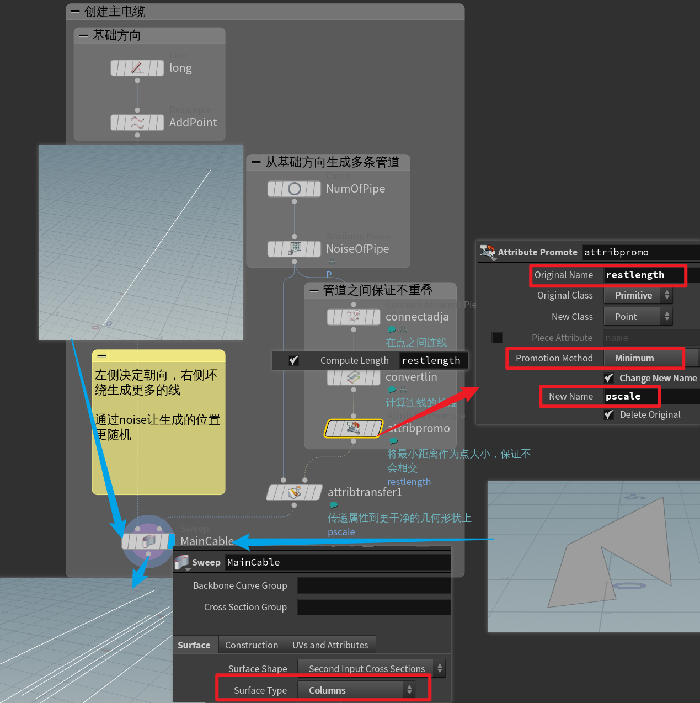

## 自定义Vex代码调整属性
使用 `Attribute Promote | 属性提升` 节点，通过 VEX 代码手动调整两个属性。

这里调整了两个效果：
1. 删除小于一定大小的主电缆。
2. 缩放主电缆。

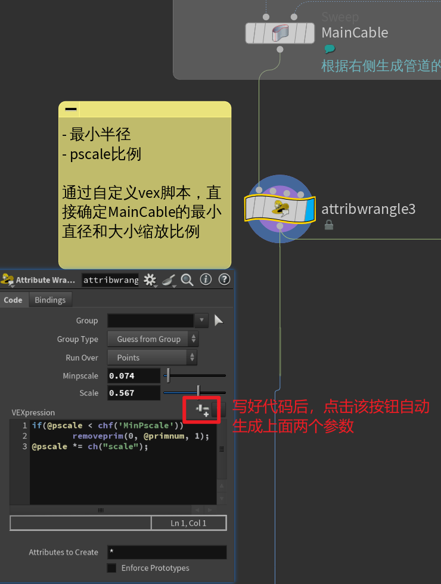

Vex代码：

```C
if(@pscale < chf('MinPscale')) // 如果生成的管道大小小于设定值（MinPscale值）
        removeprim(0, @primnum, 1); // 删除该管道

@pscale *= ch("scale"); // 调整 pscale 缩放
```

这里的缩放可以同步控制 **主管道**的大小 和 **次要管道**的环绕半径。

> 注意！**关于 pscale （1/2）**:
> 
> 属性 `pscale` 主要影响了两个参数：
> 1. 最终渲染的管道粗细
> 2. 模拟时的碰撞体积大小

## 二、创建次要电缆

### 1、随机选择主电缆
有 SideFXLabs 的帮助，这个操作会很简单。

使用 `Labs Random Selection` 节点即可：

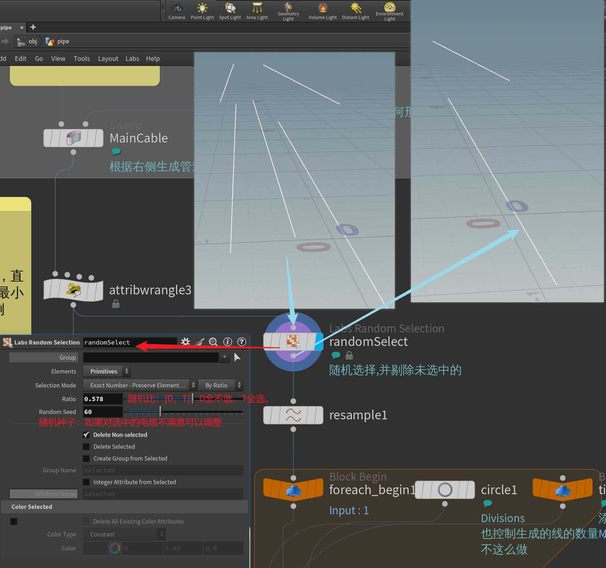

### 2、循环创建次要电缆
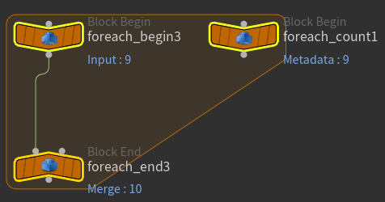

创建 For-Each 节点，将创建次要电缆作为**循环体**，以便批量创建。

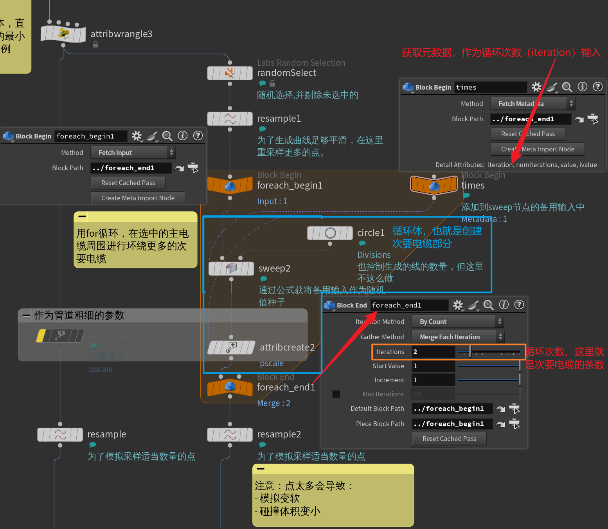

### 2、随机次要电缆 `pscale` 属性

使用 **备用输入** 获取循环次数作为随机种子

#### 创建备用参数

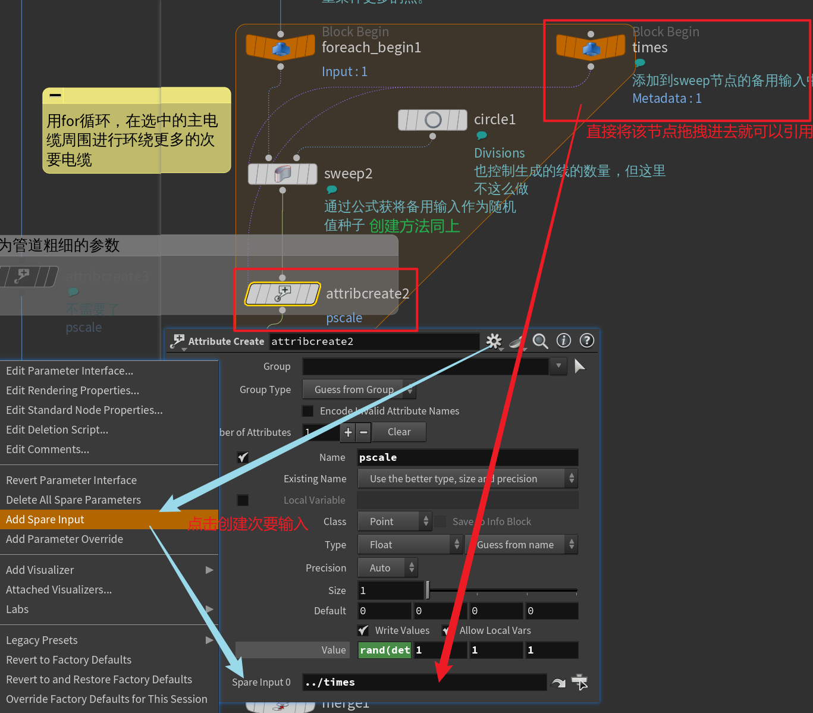

#### 引用参数作为随机种子

核心代码：detail，返回一个细节属性（detail attribute）的值。

```C
detail(-1, iteration, 0);
```
- 1：表示备用输入
- iteration：即引用的变量的值
- 0：属性索引

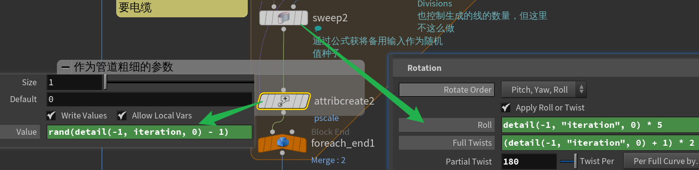

VEX代码
```C
// attribcreate2
rand(detail(-1, iteration, 0) - 1) 
// 用循环次数做索引，直接通过 rand 函数生成随机数
```
```C
// sweep2
detail(-1, "iteration", 0) * 5 // Roll
(detail(-1, "iteration", 0) + 1) * 2 // Full Twists
// Full Twists 参数必须 “+ 1”，为了避免生成值为“0”（显示为直线，没有环绕）
```

## 三、布料模拟
无论什么时候，模拟阶段都是重头戏，因为需要调整大量参数，当模拟时对参数不了解会导致调节时无从下手。

### 模拟前准备

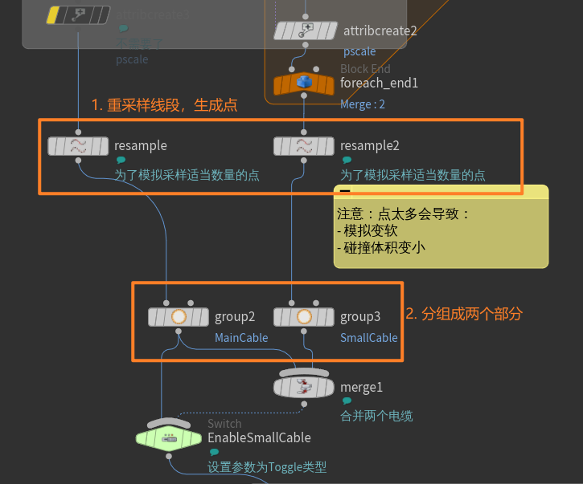
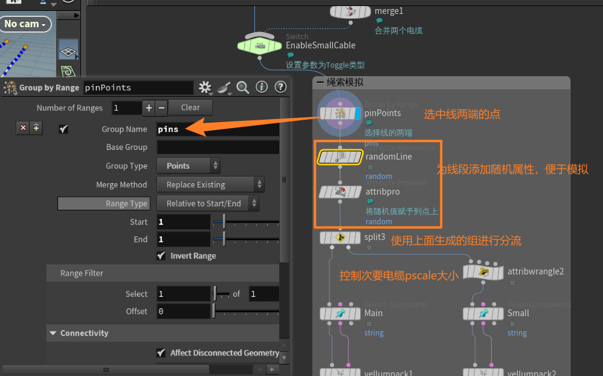

#### 1. 细分线段
创建模拟基础：使用 `Resample | 点的重新采样` 节点在原始线段上生成更多的点，这些点是模拟的基本单位。

> 注意：**点的数量也会影响解算**
> 
> 当点数量多时：
> - `pscale` 变小。
> - 绳索看上去更松弛：更容易耷拉下去，显得像是拉面一样。
> 
> 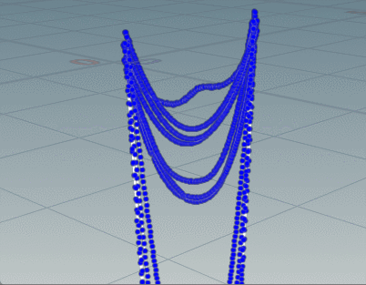

#### 2. 分组

使用 `Groups | 群组` 节点为主电缆和次要电缆打上标签，方便接下来进行区分。

#### 3. 定住两端

为了让两端不要跟着一起下落，使用 `Group by Range | 按范围分组` 节点选取线段两端的点，命名为pin，作为解算中的 `Pin Point` 参数输入。

#### 4. 分开调整参数

使用 `Split | 分流` 节点分开两股电缆，这个时候就用上上面分组产生的两个组了：


其中，要对次要电缆再次使用 `Attribute Promote | 属性提升` 节点进行精细调整：
```C
@pscale *= ch("scale"); // 调整 pscale 缩放
```

---

这里会提供一些制作时用到的参数，并指出其如何影响结果。


### `Vellum Constraints | 布料约束` 参数

| 分组 | 参数名称 | 功能 | 推荐值 |
|---|---|---|---|
|  | Constraint Type，约束类型 | 使用Houdini提供的模板，方便直接模拟类似物体 | String |
| Geometry，几何 |  |  |  |
|  | Density，密度 | 相当于控制mass重量属性，越大越不容易被别的物体影响，同时也越容易被自己的拉伸 |  |
|  | Thickness，厚度 | 相当于调整pscale参数，也就是管道粗细 |  |
| Pin to Animation，固定到动画 |  | 决定在模拟时排除哪些点 |  |
|  | Pin Points，固定点 |  | 上面创建的pin |
| Stretch  拉伸弹簧 & Bend  弯曲弹簧 |  | 似乎不像参数名称那样方便调节，并不是很理解 |  |
|  | Stiffness，刚度 |  |  |
|  | Damping Ratio，阻尼比 |  |  |
|  | Rest Length Scale，静止长度比 |  |  |
|  | Rest Angle Scale，静止角度比 |  |  |


> 关于**`Stretch | 拉伸弹簧`** & **`Bend | 弯曲弹簧`**具体是什么，可以看Constant康大佬的[vellum原理教程01](https://www.bilibili.com/video/BV1zviMeBE5H/?spm_id_from=333.1387.homepage.video_card.click&vd_source=f92a2f3367b863030638e1aca838fb57)


### `Vellum Solver | 布料解算` 解算设置

| 分组            | 参数名称                                       | 用途                       | 推荐值 |
|---------------|--------------------------------------------|--------------------------|-----|
|               | reset simulation，重新解算                      | 在使用time shift等节点时，刷新解算结果 |     |
| solver，解算     |                                            |                          |     |
|               | substeps，子步                                | 表示模拟精度，当出现穿模问题时可以提高这个值   | 4   |
| forces，力量     |                                            |                          |     |
|               | built-in wind drag，内置风阻（需要勾选built-in wind） | 空气阻力，当模拟时下落过快可以调高这个值     | 0.6 |
| visualize，可视化 |                                            |                          |     |
|               | thickness，厚度                               | 可视化点的pscale值             |     |


> 注意！**关于 pscale （2/2）**:
>
> **模拟时会限制 pscale 的最大大小**：模拟过程的最小单位是点，碰撞体积也会按点为单位创建（见下图）；为了避免碰撞体积穿插，会自动限制碰撞体积的最大大小（见下GIF，两端大小没有被缩放是因为被定住，排除出模拟范围了）

 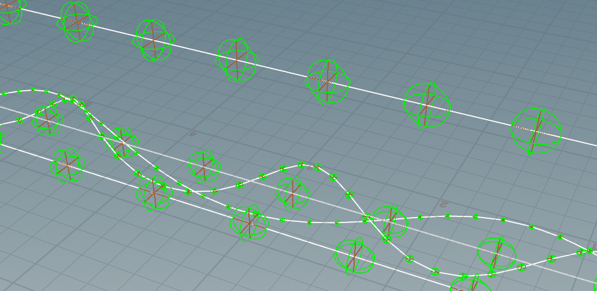

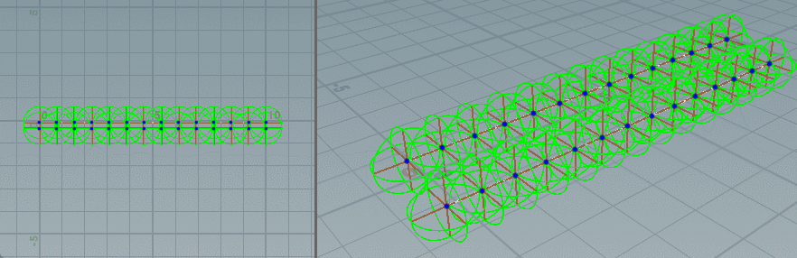


## 四、输出优化

使用 `Subdivide` `Facet` `Sweep` 节点，优化输出几何体的顶点数量

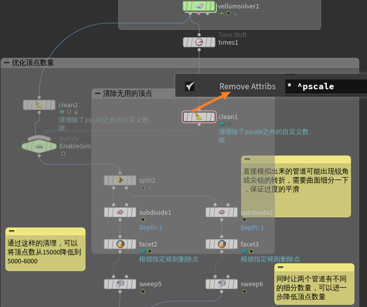

