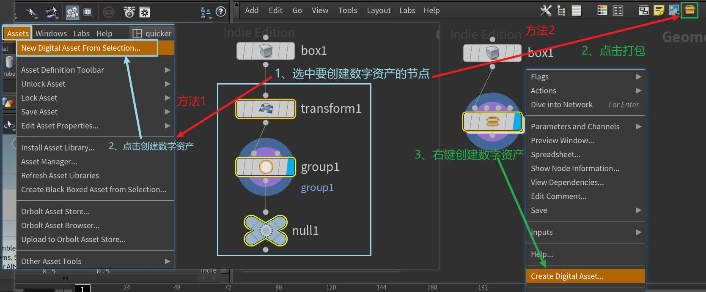
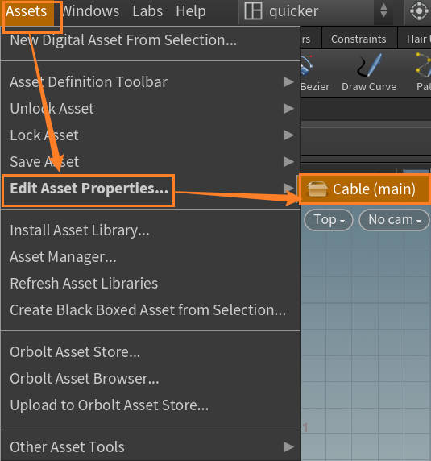

> Houdini 版本：20.5.278
> 
> SideFXLabs 版本：20.5.253
>
> unreal版本：5.4.4

# 开篇：泰坦计划
这个笔记是泰坦计划的学习记录，这里是第一章节**电缆**的基本资产内容制作笔记，对应视频的第一章，1、2、3、部分的内容。

泰坦计划是Houdini官方推出的、上千艺术家参与的开放项目；内容包含Houdini以及联动UE的方方面面。

- Houdini官方介绍：[Project Titan | SideFX](https://www.sidefx.com/titan/)
- UE新闻：[“泰坦计划”示例游戏现已推出：探索这个巨大的开放世界](https://www.unrealengine.com/zh-CN/news/the-project-titan-sample-game-is-now-available-explore-this-huge-open-world)

# 主要内容

1. 安装 `Houdini Engine for Unreal` 插件
2. 创建数字资产：介绍Houdini数字资产，并将[上一章](https://youli42.github.io/posts/Houdini%E6%B3%B0%E5%9D%A6%E8%AE%A1%E5%88%92%EF%BC%9A%E4%B8%80%E3%80%81%E7%94%B5%E7%BC%8601%EF%BC%88%E6%95%B0%E5%AD%97%E8%B5%84%E4%BA%A7%E7%9A%84%E5%88%B6%E4%BD%9C%EF%BC%9A%E8%B5%84%E4%BA%A7%E9%83%A8%E5%88%86%EF%BC%89/#%E9%87%8D%E8%A6%81%E7%9F%A5%E8%AF%86%E7%82%B9%EF%BC%9A)制作好的管道打包成数字资产（HDA）
3. 在虚幻引擎中使用Houdini Engine
4. ***联动插件与HDA的一些特性***

# 一、安装 `Houdini Engine for Unreal`

## 省流
1. 安装Houdini时勾选“Houdini Enaine for Unreal”
2. 将`C:\Program Files\Side Effects Software\Houdini <版本>\engine\unreal\<UE版本号>`中的内容复制到`C:\Program Files\Epic Games\UE_<版本号>\Engine\Plugins\Runtime`中

## 1、获取`Houdini Engine for Unreal`
两种方法：
1. 在安装时勾选 “Houdini Enaine for Unreal” 选项
2. 从[GitHub仓库](https://github.com/sideeffects/HoudiniEngineForUnreal)下载

### 1 在安装时获取

在安装时勾选 “Houdini Enaine for Unreal” 选项

安装完成后，联动插件会出现在 `安装目录 - engine - unreal` 中

> 似乎 `HoudiniLiveLink` 和 `HoudiniNiagara` 是高版本更新的插件，旧版本没有是正常的
> 
> 如果需要，可以通过Github下载到适配老版本的插件

### 2 从 GitHub 中获取

新版本中，共有三个插件：
1. [HoudiniEngine](https://github.com/sideeffects/HoudiniEngineForUnreal/releases)：允许用户直接导入HDA
2. [HoudiniLiveLink](https://github.com/sideeffects/HoudiniLiveLink/releases)：允许同步Houdini与Unreal中的视窗
3. [HoudiniNiagara](https://github.com/sideeffects/HoudiniNiagara/releases)：在Niagara中添加一个Houdini数据接口，允许使用Houdini中的点缓存资产

接下来的演示以 `HoudiniEngine` 插件为例：

点击上方插件列表，跳转到GitHub发布页面，这里会给出插件的压缩包以供下载，需要你自行选择插件版本进行安装。

下载完成后会得到一个压缩包，其中内容与`Engine - unreal`中得到的对应内容相同。

## 2、安装联动插件

将**对应版本**文件夹中的内容，直接复制到虚幻引擎的 plug 目录中：

从GitHub获取同理

# 二、创建并设置数字资产

Houdini 数字资产，即：Houdini Digital Assets（HDA），就是将已经完成的节点打包，并留`出输入输出节点`和`调整参数`的功能：

## 省流

1. 创建数字资产
2. 在弹出菜单中调整参数

## 1、创建数字资产

> 不同版本UI可能有所不同，但基本选项都差不多。

两种方法
1. 选中后在菜单中选择创建
2. 打包后右键创建

## 2、设置数字资产

### 初始化数字资产

在弹出菜单中，指定名称、版本、作者等基础信息

### 设置数字资产参数

确定后，会弹出数字资产设置页面：

> 再次打开该界面：
>
> 选中场景中的HDA后，在Assets中选择Edit Asset Properties即可
> 
> 

在 `Parameters` 界面可以设置选中数字资产后的参数：

之后使用数字资产时，可以直接使用这里设置的参数，而非进入内部调整。

设置好后，点击下方Apply进行保存，此时可以在储存目录（默认是：C:\Users\用户名\Documents\houdini20.5\otls）找到创建的.hda文件。

# 三、将HDA导入UE

***确认已经正确安装Houdini Engine For Unreal插件，并启用它：***

找到上面创建的HDA文件，直接拖拽即可导入：

此时将 HDA 拖入场景中，可以看到 HDA 占位符：

在细节面板中，HDA相比普通物体多出了很多Houdini选项：

这里需要将 Houdini Inputs 中的输入数据类型设置为：`Curve Input | 曲线输入` ，然后就可以看到我们搭建的管道了

# 四、联动插件与HDA的一些特性

## 在houdini中查看UE场景

可以通过同步功能，在Houdini中查看UE传递的数据，并调整节点信息

刚打开场景可能时空的，此时需要在UE的HDA细节面板中触发Rebuild，让场景中的节点更新到Houdini中。

##　解锁HDA

编辑内部节点：

创建一个新的数字资产后，默认图标右下角会有一个红色的“解开的锁”图标，代表这个HDA可以被编辑内部节点。

当添加了新的数字资产后，会变成上锁的状态，此时无法可以查看，但是无法编辑内部节点。需要右键允许编辑后，才能恢复可编辑状态。

## 更新与保存HDA

保存的 HDA 已经与该场景无关，此时使用 Ctrl + S 只会保存场景，无法更新HDA。

应该当在编辑面板中，重新选择应用应用HDA才能进行更新。

特别是，当你在与虚幻联动时修改了HDA的内容，想要保存，应当使用以上面板中的按键，并在UE中更新HDA。

### 更新UE中的HDA

使用按钮更新了HDA后，应当右键HDA，选择重新载入。