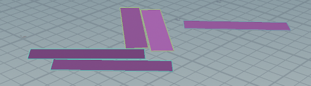

> Houdini 版本：20.5.278
>
> SideFXLabs 版本：20.5.253
>
> HoudiniEngineForUnreal 版本：2.2.0
>
> unreal版本：5.4.4
<iframe src="//player.bilibili.com/player.html?isOutside=true&aid=114561373967249&bvid=BV1n8j4zvEfS&cid=30122905349&p=1" 
    scrolling="no" 
    border="0" 
    frameborder="no" 
    framespacing="0" 
    allowfullscreen="true"
    width="100%" 
    height="100%">
</iframe>
# 内容概述
使用Data Table向Houdini中传递模型长宽数据，并在Houdini中进行散布，将结果作为带属性的点传递回UE，在UE中进行实例化成模型

# HDA功能概述
- 数据输入：
  - BaseBoundBox：边界框，用Box Brush比较方便，用来决定散布的基础形状
  - StackingMesh：直接输入需要散布的几何体
  - DataTableFromUnreal：用来记录UE中模型数据的表格
  - Collider：刚体碰撞体，用来充当地面或进行物理模拟
- 资产输出：
  - 向 UE 中输出带有实例化信息的点，在 UE 中进行实例化，显示散布效果

# 核心知识
## 1、Unreal Data Table
是这个教程向 Houdini 传递数据的媒介，本质就是一个表格，我们这里用来记录模型大小：
基于数据结构创建的 Data Table ，并填写相关信息：

这里向 Houdini 输入了长宽高、模型储存位置、偏移值等信息。
其中的**模型储存位置**是实例化的基础：
- 如果 Houdini 中传递到 UE 中的点属性名称为 `unreal_instance`
- 且该属性的值为：指向模型储存位置的路径（ UE 内容浏览器路径）
  - 会在该点位置创建该模型
## 2、使用 Piece Attribute 进行随机散布
- **目的**：将输入的不同的网格体随机散布到不同的点上
- **原理**：使用 `Copy to Points `中的 `Piece Attribute` 参数

 > 【**官方文档**】：
 > The name of an integer or string target point attribute, and corresponding source point or primitive attribute, indicating what parts of the source should be copied to each target point. All source points or primitives with a value matching a target point’s value will be copied to that target point. If the target point attribute is an integer attribute and no source attribute exists, the integer will specify which single primitive to copy from the source to each target point.
 > 一个整数或字符串目标点属性的名称，以及相应的源点或原始体属性，指示应将源的哪些部分复制到每个目标点。所有与目标点的值匹配的源点或原始体的值都将被复制到该目标点。如果目标点属性是整数属性且不存在相应的源属性，则该整数将指定从源复制到每个目标点的单个原始体。
 
 - 即：散布时，复制到点上的物体拥有与该点相同的属性值。
 - 举例：
   - `Copy To Point `节点中的 `Piece Attribute` 参数值为 **Variant**
   - 物体A、B、C上的 Variant 属性分别为1、2、3
   - 执行 `Copy To Point `节点后：
     - 属性 Variant 值为1的点会被复制为A
     - 属性 Variant 值为2的点会被复制为B
     - 属性 Variant 值为3的点会被复制为C
### 操作方法
### 1、为每个模型设置独立的 `Variant` 属性值
1. Connetivity 节点会为每个物体生成一个 Primitives 层级的 class 属性
2. 使用 Attribute Promote 属性提升 节点将其赋予 Point 层级，方便使用

此时，每个完整拓扑结构的几何体都会有一个唯一的 Variant 属性值
### 2、指定点的属性
1. 确定物体数量：
  1. 目的：避免随机到没有被分配模型的值
  2. 方法：使用上面 Connetivity 节点产生的 class 属性中的最大值作为随机数最大值
2. 为每个点分配随机数：
  1. 使用 Attribute Randomize 节点，对点的 Variant 属性进行随机
  2. 同时使用离散（Discrete）模式，随机整数

其中的HScript脚本为：
```C
// 以下两行任选一行
detail("../GetObjectNumber", "max", 0)
detail(-1, "max", 0) // 这里创建了备用输入，所以也可也这样写
```
- 作用：获取 `GetObjectNumber` 节点中的 `max` 属性值
- `detail()`：返回一个细节属性（detail attribute）的值。
  - `"../GetObjectNumber"`：sop 节点路径，关于备用输入可以看[这里](https://youli42.github.io/posts/Houdini%E6%B3%B0%E5%9D%A6%E8%AE%A1%E5%88%92%EF%BC%9A%E4%B8%80%E3%80%81%E7%94%B5%E7%BC%8601%EF%BC%88%E6%95%B0%E5%AD%97%E8%B5%84%E4%BA%A7%E7%9A%84%E5%88%B6%E4%BD%9C%EF%BC%9A%E8%B5%84%E4%BA%A7%E9%83%A8%E5%88%86%EF%BC%89/#:~:text=%E4%BD%9C%E4%B8%BA%E9%9A%8F%E6%9C%BA%E7%A7%8D%E5%AD%90-,%E5%88%9B%E5%BB%BA%E5%A4%87%E7%94%A8%E5%8F%82%E6%95%B0,-%E5%BC%95%E7%94%A8%E5%8F%82%E6%95%B0%E4%BD%9C%E4%B8%BA)
  - `"max"`：属性名称
  - `0`：属性索引
### 3、启用 Piece Attribute 参数
1. 将 Variant 类型转换到 int16 ，因为 Piece Attribute 只接受该类型
2. 将包含属性的模型和点分别连入 Copy To Points 节点
3. 启用 Piece Attribute 参数，并填入上面定义的属性：**Variant**

此时，输入的立方体应当被正确复制到点上：


## 3、通过 UV Layout 能力打包模型（核心知识点）

### UV Layout 节点
> 【**官方文档**】：
> UV Layout tightly packs UV islands into texture tiles. UV Layout can tightly pack any set of 2D profiles (islands) into any other set of 2D profiles (targets), without any restrictions on the number or size of islands or targets or the attributes that describe them. Islands can be assigned to specific targets or left un-assigned so that UV Layout can choose a target for them that allows a tightest packing.
> UV 布局紧密地将 UV 岛屿打包到纹理瓦片中。UV 布局可以将任意一组 2D 轮廓（岛屿）紧密地打包到另一组任意 2D 轮廓（目标）中，没有任何关于岛屿或目标的数量、大小或描述它们的属性的限制。岛屿可以被分配到特定的目标，也可以不分配，以便 UV 布局可以根据允许最紧密打包的目标来选择。

简单来说：将一片一片的对象打包到一个指定区域中，并尽可能提高二维空间的利用率

### 目的
将模型用作打包对象，传入的 BaseBoundBox 边界框作为打包目标，将重叠的模型不重叠排布到平面上。

### 调整参数

| 1. UV Attribute：P，ZX Projection：打包对象设置为模型位置，并从俯视角打包<br>2. Variable Scaling - Island Scale Attribute：使用iscale作为模型大小的参数<br>3. Overrides - Axis Alignment：设置为none，保留旋转信息<br>4. Pack Into：Islands From Second Input：使用传入的模型作为打包目标<br>5. 勾选Variable Scaling - Island Scale Attire...：使用 iscale 属性调整模型大小<br>6. 将Packing - Scale 改成Fixed，数值设为1：避免节点为了排布所有模型，而缩小模型大小<br>7. Advanced - Search Resolution：分辨率，调小可以加快打包速度，但是空隙也会变大<br>8. **Targets** - UV Attribute：P，ZX Projection：打包对象设置为模型位置，并从俯视角打包<br>9.  Output Groups and Attributes - Nonpacked Polygons：勾选这个选项，可以将溢出部分分组，方便删除 |  |
| --------------------------------------------------------------------------------------------------------------------------------------------------------------------------------------------------------------------------------------------------------------------------------------------------------------------------------------------------------------------------------------------------------------------------------------------------------------------------------------------------------------------------------------------------------------------------- | ------------------------------------------------ |
### 注意点：
如果撒点过多，可能会导致打包的时候模型溢出：

此时已经勾选了 Output Groups and Attributes - Nonpacked Polygons 选项，可以直接使用 Blast 节点删除 nonpacked 组（也就是溢出部分）

***但是不推荐这么做***

因为过多模型可能会导致 UV Layout 的时候重复排列，散布后，会倾向于使用第一个模型：

此时：减少撒点数量：减少重复度，但是过少会导致无法完全填充。

## 4、通过循环堆叠更高的层
### 基本思路
这里的思路有点怪
1. 找到最高的面片
2. 将面片聚类（Cluster Points）分组
3. 每个分组创建一个包含分组的平面，作为再次撒点的基础
4. 重复放置，重复几次就放置几层
### 1. 找到最高处的面片
筛选出最高的面片后，需要在最高的面片上散布，所以要筛选出最高的一组面片。

解决方法：
1. 将点的y轴数据存储为浮点数：`f@PyHeight = @P.y;`
2. 将属性提升到 Primitive 层级
3. 将属性提升到 Detial 层级，使用 Promotion Method：Maximum 方法，选出最大值
4. 传递其他属性
5. 在 Blast 节点的 Group 参数中，使用 HScript 脚本，找出高度 y 与最大值相同的面片，并删除其他部分：
```C
@PyHeight=`detail(0,"PyHeight_Max",0)`
```
> **注意**：
> 
> 1. 执行脚本需要用“\`”包裹两端
> 2. detail和details函数的使用
> 	1. 针对浮点等**数据类型**：`detail(<表面节点路径>, <属性名称>, <属性索引>)`
> 	2. 针对**string**字符串类型：`details(<表面节点路径>, <属性名称>)`
> 3. 第2、3步的两次属性提升（Attribute Promote）
> 	1. 将PyHeight提升到Primitives层级，让其属于一个物体
> 	2. 将其提升到Dital层级，并使用*Promotion Method - Maximum*筛选出其中的最大值

#### 效果
此时可以正确筛选出最高的面片


### 2. 聚类分组，生成二级基础平面
1. 聚类：使用 `Cluster Points` 聚类点 节点，按照临近关系进行分组
2. 创建平面：在循环中，对于每一个分组，用 `Shrinkwrap` 收缩包裹 创建平面
  1. 这里通过一个 Transform 对平面进行缩小，尽量避免模型出现悬空（实际是除非每个平面都是一个组，否则几乎无法缓解，只能通过模拟阶段解决）

**节点参数**：
- `Cluster Points` 聚类点：
  - Ckyster Settings - Clusters：聚类分组数量，生成分组的目标数量，上图就是为1的情况。
- `Shrinkwrap` 收缩包裹 ：
  - 将 Type 类型 设置为2D，使其正确生成平面。

> 接下来就是与上面类似的 UVLayout 打包过程，并与开始的数据合并输出循环，这里不做赘述


## 5、创建 UE 用于实例化模型的点（易错点）
UE 并没有传递整个模型到 Houdini 中，而是通过点的属性进行实例化，也就是开头 Data Table 传递的数据：
- 如果 Houdini 中传递到 UE 中的点属性名称为 `unreal_instance`
- 且该属性的值为：指向模型储存位置的路径（ UE 内容浏览器路径）
  - 会在该点位置创建该模型
### 创建思路
1. 更正属性：通过重命名等，将属性转化成可以在UE中识别的名称
  1. UVLayout 控制大小：`iscale` → UE控制模型大小：`pscale`
  2. Data Table 传递过来的 Static Mesh 属性 → UE实例化模型属性：unreal_instance
2. 为每个模型创建居中的点：
```C
// 也可也使用 Extract Centroid 提取质心节点
vector center = getbbox_center(0); 
addpoint(-1, center);
```
3. 传递需要的属性：因为之前打包，现在需要解包拿到正确的属性，并传递

### 踩坑记录
### 生成UE_instance需要的属性
生成了一堆点，但是在UE中没有正常显示出来，应该是缺少了UE实例化的一些属性。
- 参考链接[Houdini Engine读取UE5 DataTable表单 - 知乎](https://zhuanlan.zhihu.com/p/510021140)
#### 相关属性
- **实例化对象**：`unreal_instance`(指向模型位置，结构体内数据类型：**静态网格体**)
- **实例化大小**：`pscale`，然而删除pscale后，依然有大小变化。不过pscale一定是主要影响因素
- **实例化旋转方向**：`orient`
### 实例化后位置不对
最后生成的点位置应当和本地坐标轴相同，这里生成在模型中心，所以需要使用 UE 建模模式，调整模型轴心位置。

### 实例化对象错误、上层大小不对
这俩应该都是在“将模型原点放在Box底部中心”阶段产生的错误，一个是`StaticMeshPath`属性，一个是`pscale`。
#### 对象错误
本来应当是基本随机，但是有一个对象大量出现；经检查发现，很多不是这个对象的模型也实例化成了这个对象。

同时，只有上层堆叠会出现问题，~~推测是在循环堆叠时出现的问题~~循环放置结束后，点和实例路径的对应关系没错。
#### 错误原因
在“将模型原点放在Box底部中心”步骤中，属性传递错误：~~实例化属性在模型上，并没有传递到生成的用作模型中心点位置的point上。~~实例化后，模型StaticMeshPath属性似乎只有第一个值，此时进行传递，只会得到第一个模型。

#### 解决方法
在循环创建中心点的时候，将属性传递给生成的点

具体操作看下面的解决问题部分
### 上层大小错误


没有出现问题的情况：
- `pscale` 为定值
- `pscale` 递增（？）
出现问题的情况：
- `pscale` 使用随机数
#### 具体来说：
这里使用**分层堆叠**，第一层暂时发现没有问题

对于上层：如果随机[0.5, 1, ,1.5]三个pscale，会有部分本应传递小值的被传递成1.5最大值

#### 尝试排查
尝试通过同时显示点的不同参数调整
##### 属性可视化

这里本应该不是最大值(1.5)
### 原因分析
在`Attribute Wrangle`中，创建了一个新的点，但模型上有一个数据，没有正确传递给点

## 解决问题

- Point层级：
  - `StaticMeshPath` 模型路径 
  - `orient` 旋转方向 
- Primitives层级：
  - `iscale` 缩放大小
以上属性的正确值都储存在解包后的模型信息中，我需要将其传递到点层级的目标属性中

1. 解包获取数据：解包一下再通过 `Attribute Transfer` 传递数据
2. 使用 vex 让Primitives层级的iscale属性值覆盖掉Poin层级的 `pscale` 属性
不知道为什么，直接使用 `Attribute Promote` 节点无法传递数据（传递到了打包的模型上，而生成的点上没有传递），所以使用以下vex代码：
```C
f@pscale = prim(0, "iscale", 0);
```
> 尝试了一下，可能是因为 `Attribute Promote` 节点在循环内部的缘故。


# 小知识点
## 1、UE形状网格体操作

使用笔刷编辑模式而不是建模模式

然后可以进行挤出面等建模操作。

## 2、估计大小
将鼠标悬停在模型上，会显示UE中自动计算的长宽高数值，这里用来传递到Houdini中进行排布计算：

应该对应着 “x - y - z” 顺序的BBox大小（UE坐标系），所以这个方法只适用于比较规则的立方体，无法传递精确碰撞信息。
同时，因为是BBox，所以往往大于实际值， 需要手动传递偏移数据。
然而，Houdini中，似乎 `width` 、 `length` 、 `height` 三个属性对应了虚幻坐标系中的“y - x - z”，重命名和传递偏移值的时候需要注意。

| 对应关系（UE坐标系） | x     | y      | z      |
| ----------- | ----- | ------ | ------ |
| Houdini参数   | width | length | height |
| Houdini坐标系  | x     | z      | y      |

## 3、打包与解包

1. 属性传递：两个节点都需要手动填写 `Transfer Attributes` 传输属性 参数，一般直接填写 `*` 传递所有参数。
2. 打包效果：根据 `Path Attribute` 和  `Name Attribute` 对模型进行分类打包，通常一个包只在属性列表（Geometry Spreadsheet）中显示一行，占用更少的性能。
## 4、模拟部分
这里只使用了基础刚体模拟，故只写注意点。
## 模拟时旋转错误

- **旋转属性**：
  - RBD Bullet Solver 中作为旋转属性的是：torque
  - 以上散布时使用的旋转属性是：orient
- 所以需要 Attribute Rename 更改属性名称为解算可以识别的名称。

# 5、自定义属性可视化
属性可视化


# 遗留问题
## 实例化对象位置错误
Houdini 只能获取手动输入的 BBox 长宽高，但是这个数据是 UE 自动计算的最外围包围盒，会计算一些装饰的大小，所以实际模拟后，会看起来是悬空的状态。
### 临时解决方法
在 Data Table 中额外传递长宽高的偏移值，手动调整大小。

# 额外使用方法

通过 UV Layout 能力打包模型是这个教程的核心知识点：
- 本教程使用目的：
  - 创建平面散布
- 其他使用方法：
  - 杂乱的海报效果：对墙面使用散布，让海报排布在上面