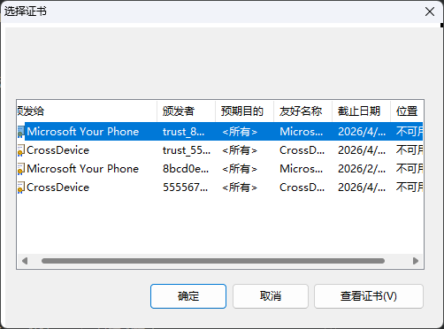
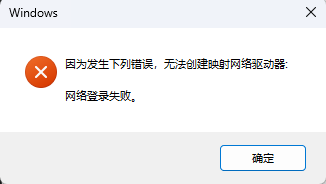
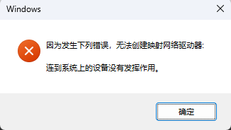

# 前言
省流：
- 购买软路由后内置一个定制的 OpenWRT ，但无法在虚拟网络中使用 smb 挂载，故希望重置系统尝试配置。

> 碎碎念版：
> 为了~~满足下好奇和折腾~~自动认证校园网和远程唤醒，同时充当下 NAS ，同步一下笔记和各种文件，所以在小黄鱼上整了个 j1900 的小主机做软路由，用了一下确实好使，打游戏都不卡了（这是真神奇）。
> 但是，这个商家内置的是不知道从哪里下载的深度定制的 OpenWRT 固件，内置了大部分 IStore OS 的功能？但是显示的还是 OpenWRT ，很奇怪，但是确实好用。
> 唯一的问题就是，无法在 easytier 虚拟局域网中使用 SMB 共享，经过一通折腾，网络配置彻底混乱，内网共享也无法使用。实在搞不清楚这个混沌系统里面都有什么，故想要重新安装 IStore ，手动配置，同时学习一下软路由网络和使用。

# 设备背景
- CPU：J1900
- iStoreOS 24.10.1 2025060614
- Docker：
	- 版本：27.3.1
	- API版本：1.47
- easytier：2.3.1-a6773aa5
- Samba version 4.18.8

# 问题
**无法通过虚拟网络连接 smb 共享文件夹**
通过局域网地址，即 192.168.100.1 可以正常挂载 smb 共享文件夹；但是使用 easytier 创建虚拟局域网，通过虚拟地址挂载 smb 责会出现各种各样的错误。

## 情况描述
使用 192.168.100.1 作为目标地址，可以正常挂载；

虚拟局域网状态：可以正常 ping 通和访问网页
使用虚拟网络时，输入正确的虚拟局域网路径、账号、密码后，会卡一段时间，接着出现选择证书页面

无论选择哪个之后都会要求重新输入密码，输入后弹出：
此后再尝试，会出现：


# 省流
Samba 配置文件错误，应修改成：
```shell
[global]
	# 指定监听哪些网络接口
	interfaces = 虚拟IP地址/24 br-lan
	# 此全局参数允许 Samba 管理员限制机器上的哪些接口将响应 SMB 请求
	bind interfaces only = yes
```


# Samba配置问题
> 前提知识：Samba 服务的行为大部分由 `/etc/samba/smb.conf` 配置文件控制

## 检查监听端口
```shell
root@iStoreOS:~# netstat -tulnp | grep smbd
tcp        0      0 192.168.100.1:445       0.0.0.0:*               LISTEN      1173/smbd
tcp        0      0 192.168.100.1:139       0.0.0.0:*               LISTEN      1173/smbd
```
显然，只监听了 192 的内网地址。

对应的samba配置文件：
```shell
[global]
	# 指定监听哪些网络接口，其中的 tun0 是手动添加的虚拟网卡地址
	interfaces = br-lan tun0
	# 此全局参数允许 Samba 管理员限制机器上的哪些接口将响应 SMB 请求
	bind interfaces only = yes
```
**临时解决方法**：
配置：`bind interfaces only = no` ，然后执行 `service samba4 restart` 重启即可
此时的网络监听：
```shell
root@iStoreOS:~# netstat -tulnp | grep smbd
tcp        0      0 0.0.0.0:445             0.0.0.0:*               LISTEN      2589/smbd
tcp        0      0 :::445                  :::*                    LISTEN      2589/smbd
```
此时可以正常访问了，但是显然不安全，而直接使用 tun0 接口名称，并不生效，接下来尝试修改绑定端口。
参考链接：[Samba修改绑定端口和IP的方法 - 没有星星的夏季 - 博客园](https://www.cnblogs.com/shanfeng1000/p/18162264)
配置文件，通过 IP 地址指定监听：
```shell
[global]
	# 指定监听哪些网络接口
	interfaces = 虚拟IP地址/24 br-lan
	# 此全局参数允许 Samba 管理员限制机器上的哪些接口将响应 SMB 请求
	bind interfaces only = yes
```
（没测试 /24 是不是必须的，就这样吧）

# 其他相关命令
> 思路不对的时候真折磨啊，网络问题排查了八百遍，还重装了 istore ，重新配置了一堆东西（）而且配置的 smartDNS 啥的都丢了可还行

## Linux相关命令
- `smbstatus`：查看共享文件夹使用情况
```shell
root@iStoreOS:~# smbstatus

Samba version 4.18.8
PID     Username     Group        Machine                                   Protocol Version  Encryption           Signing
----------------------------------------------------------------------------------------------------------------------------------------
3704    smb          unishare     192.168.100.245 (ipv4:192.168.100.245:14223) SMB3_11           AES-128-GCM          AES-128-GMAC

Service      pid     Machine       Connected at                     Encryption   Signing
---------------------------------------------------------------------------------------------
WRTSMB       3704    192.168.100.245 Fri Jun 20 13:56:54 2025 CST     AES-128-GCM  AES-128-GMAC


Locked files:
Pid          User(ID)   DenyMode   Access      R/W        Oplock           SharePath   Name   Time
--------------------------------------------------------------------------------------------------
3704         0          DENY_ALL   0x100080    RDONLY     NONE             /mnt/data_sda4   .   Fri Jun 20 13:56:55 2025
```
- `service samba4 restart`：重启 samba 服务

## Windows相关命令
- `net use`：查看挂载的共享文件夹
- `net share`：查看 Windows 共享文件夹
- `net use z: \\10.13.0.99\c$ password /user:username`：挂载共享文件夹
- `net use z: /del`：删除共享文件夹