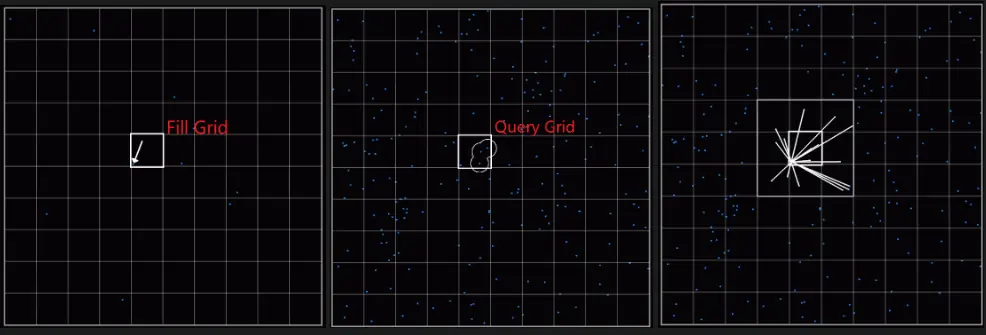
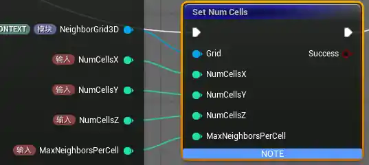
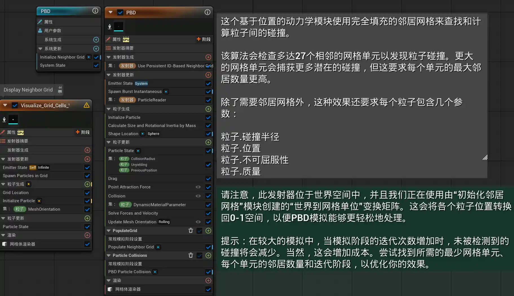
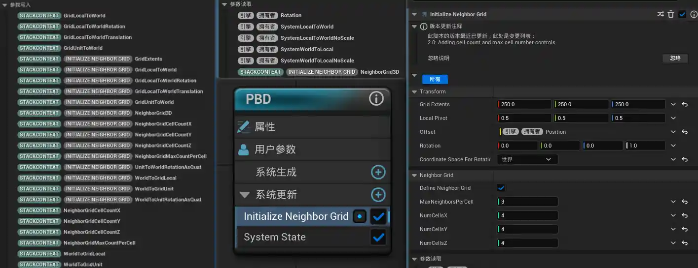
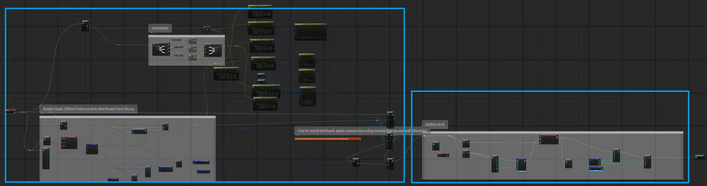
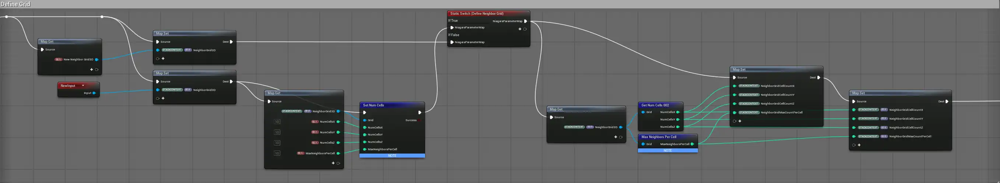
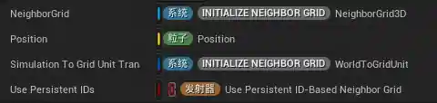
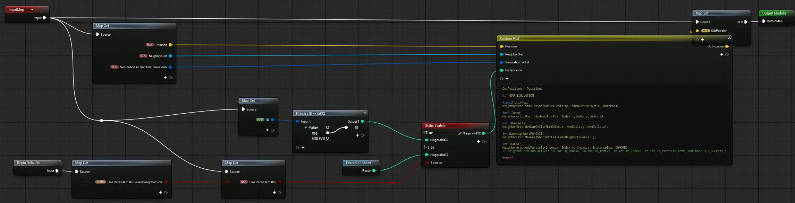
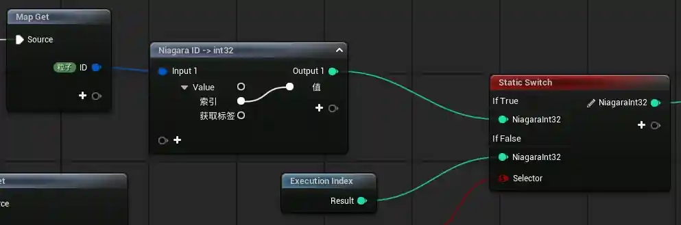
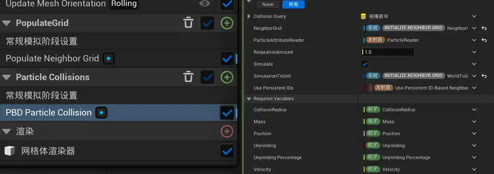

本文是对虚幻引擎内容示例（Content Examples）中 Niagara 高级示例部分的拆解笔记。

具体来说，是 Content Examples 项目中 Niagara_Advanced_Particles 地图里的临近网格体部分（Position Based Dynamics、Plexus、Structural Support、Boids）

示例项目 Fab 链接：[https://www.fab.com/listings/4d251261-d98c-48e2-baee-8f4e47c67091](https://www.fab.com/listings/4d251261-d98c-48e2-baee-8f4e47c67091)

## 什么是 Neighbor Grid 3D | 临近网格体

Neighbor Grid 3D（临近网格体）是 Niagara 中用于空间查询的数据结构。

### 为什么需要它

- **降低计算复杂度**
    - 在没有空间分区的情况下，若每个粒子都要感知周围粒子，计算量为 $O(n^2)$（遍历所有粒，参考下面的视频）。使用网格后，查询范围被限制在相邻体素内，复杂度降低至接近 $O(n)$。
    - <video width="100%" height="auto" controls loop autoplay muted>   <source src="/posts/虚幻内容示例：Niagara临近网格效果拆解（上）/遍历效果_压缩版.mp4" type="video/mp4">  您的浏览器不支持 HTML5 视频播放。</video>
- **突破 GPU 线程限制**
    - GPU 擅长并行计算，但不擅长全局搜索。网格体提供了一个预排序的查找表，让成千上万个线程能同时在局部区域内高效定位数据。
- **实现复杂的群体智能**
    - 像 Boids 算法中的对齐（Alignment）和斥力（Separation）需要频繁读取邻居的速度和位置，网格体是支撑实时高密度群体行为的性能底座。
- **优化显存带宽利用**
    - 通过将空间相近的粒子数据在逻辑上归类，减少了在执行空间查询时对显存的随机访问开销。
### 它是如何做的

它将三维空间划分为均匀的体素网格，每个体素存储该空间范围内粒子索引的列表。通过这种数据结构，粒子可以高效地查询其邻近的其他粒子，而无需遍历所有粒子进行距离计算。


这为实现粒子间的连线效果、碰撞检测、群体行为等提供了性能优化的基础。

## 虚幻中，如何使用Neighbor Grid 3D

> Neighbor Grid 3D 依赖模拟阶段，而模拟阶段依赖GPU粒子，所以以下发射器都是 GPU 模式

在虚幻 Niagara 中使用 Neighbor Grid 3D 主要分为两个阶段：

1. **初始化网格** ：创建必要数据结构。
2. **查询邻居粒子**：从粒子中获取信息，以便后续操作。

下面分别简单介绍这两个步骤的关键部分，具体案例将在 PBD 实例中实现。

### 初始化网格

初始化阶段需要完成两个任务：

1. 创建网格结构：提供一个位置存放网格数据
2. 注册粒子：让系统知道，每个网格中都有哪些粒子

#### 1. 创建网格结构

使用 `Set Num Cells` 节点在 Niagara 系统中创建指定尺寸的 3D 网格。



这个操作通常在 **System Update** 阶段执行，这是为了：
1. 确保每帧开始时网格处于正确的状态
2. 确保每个发射器都可以获取到相同的 Neighbor Grid

参数说明：
- Grid：NeighborGrid3D 接口
- NumCellsX/Y/Z：网格尺寸：X/Y/Z轴上的单元格数量
- MaxNeighborsPerCell：最大邻居数：每个单元格最多能存储的粒子索引数（也就是[插槽](https://note.youlid.dpdns.org/share/7PsVoLcJdgI4)的数量）

#### 2. 注册粒子到网格

使用 `NeighborGrid.AddParticle` 将粒子注册到对应的体素中。

```
`NeighborGrid.AddParticle(in int In_IndexX, in int In_IndexY, in int In_IndexZ, in int In_ParticleIndex, out bool Out_Success);
```

- in int In_IndexXYZ：单位空间索引（即 Unit 空间，需要转换）
- in int In_ParticleIndex：粒子索引
- out bool Out_Success：是否成功输出

内部逻辑：

- 根据粒子位置计算体素坐标 `(CellX, CellY, CellZ)`。
- 计算该 Cell 在线性缓冲区中的**起始偏移地址**。
- 利用**原子操作**在该 Cell 的固定容量（Slot）内占用一个坑位。
- 将粒子索引写入该坑位；若坑位已满则返回失败。

### 查询邻居粒子

查询阶段是实现空间查询的核心，通过读取临近网格数据获取临近粒子的属性，避免遍历所有粒子。

#### 核心思路：循环遍历27个相邻网格体

Neighbor Grid 的核心优势在于将全局搜索转化为局部查询。对于任意一个粒子，其可能存在的邻居粒子只分布在其所在的体素以及周围 **26 个相邻体素** 中（3×3×3 - 1 = 26），加上自身所在的体素，总共需要检查 **27 个体素**。

这种方法的计算复杂度从 O(n²) 降低到接近 O(n)，因为每个粒子只需要检查固定数量的体素，而不需要遍历整个粒子列表。

#### 具体实现步骤

**步骤1：创建粒子属性读取器**

首先需要创建一个粒子属性读取器（Particle Attribute Reader），用于读取其他粒子的属性数据

**步骤2：遍历27个体素并读取邻居属性**

有两种方式进行遍历：

```C++
for (int x = -1; x <= 1; x++)
{
    for (int y = -1; y <= 1; y++)
    {
        for (int z = -1; z <= 1; z++)
        {
        }
    }
}
```

或者使用提前声明的数组：

```C++
const int3 IndexOffsets [ 27 ] = 
{
	int3(-1,-1,-1),
	int3(-1,-1, 0),
	int3(-1,-1, 1),
// 用来偏移的数组
	int3(1, 1,-1),
	int3(1, 1, 0),
	int3(1, 1, 1),
};

for (int xxx = 0; xxx < 27; ++xxx) 
{
	for (int i = 0; i < MaxNeighborsPerCell; ++i)
	{
		const int3 IndexToUse =Index + IndexOffsets[xxx];
	}
}
```

这个代码是使用 Neighbor Grid 3D 必要的基础。

> 注意，这些循环严格来说，不是对当前单元格中实际存在的每个粒子进行一次计算，而是对每个 **该单元格被分配的最大容量[槽位](https://note.youlid.dpdns.org/share/7PsVoLcJdgI4)（Slots）** 执行一次。

## Position Based Dynamics | 基于位置的动力学
<video width="100%" height="auto" controls loop autoplay muted> 
  <source src="/posts/虚幻内容示例：Niagara临近网格效果拆解（上）/compressed_video.mp4" type="video/mp4">
  您的浏览器不支持 HTML5 视频播放。
</video>

> 视频中的立方体是对 Neighbor Grid 3D 网格的可视化，但NeighborGrid3D 接口本质是 **GPU 内存中的线性缓冲区**（Array），用于存储粒子的索引信息。

对 Neighbor Grid 3D 最基本的使用，先来了解如何使用 Neighbor Grid 3D，对于 PDB 的介绍在涉及到 PBD 的部分进行。

### 发射器概览


> Visualize_Grid_Cells_Via_UnitToWorldTransforms：显示 Neighbor Grid 网格
> PBD：中间的碰撞小球

### 初始化网格

#### 1. 创建网格结构

这里直接使用自定义模块 `Initialize Neighbor Grid` 来初始化，该模块放在发射器更新部分，保证 `NeighborGrid3D` 变量可以被所有发射器读取。



发射器的参数简介：

##### 一、 Transform（变换参数）

这部分定义了网格在世界空间中“长什么样”、“在哪儿”。

- **Grid Extents (网格范围):**
    定义了网格体在 X、Y、Z 三个方向上的**总尺寸**（单位通常是厘米/虚幻单位）。
    - _TA 视角：_ 如果你的粒子跑出了这个范围，它们将无法被计入邻居查找逻辑。
- **Local Pivot (局部中心):**
    控制网格相对于其位置的偏移。默认 `(0.5, 0.5, 0.5)` 表示网格的中心点就在它的位置属性上（即居中对齐）。
- **Offset (偏移/位置):**
    图中你将其绑定到了 `Engine.Owner.Position`（发射器所有者的位置）。这意味着**网格会跟着物体移动**。对于 Boids 系统，这能确保模拟范围始终覆盖在你的“鸟群”周围。
- **Rotation (旋转):**
    网格的旋转。通常保持默认即可，除非你的模拟环境有特定的方向性。
- **Coordinate Space (坐标空间):**
    设置为“世界”。这意味着网格的尺寸和位置都基于世界坐标，这对处理跨发射器的交互非常重要。

##### 二、 Neighbor Grid（核心逻辑参数）

这部分决定了邻居查找的**精度**和**性能**开销。

- **Define Neighbor Grid (定义邻居网格):**
    勾选后，Niagara 会在内存中真正分配这块数据结构。
- **MaxNeighborsPerCell (单格最大邻居数):**
    **性能关键点！** 它定义了**每个小格子里最多能存多少个粒子索引**。
    - _注意：_ 如果你的粒子非常密集（比如 100 个粒子挤在一个格子里），但这个值设为 `10`，那么只有前 10 个粒子会被记录，剩下的会被“无视”。
    - _优化建议：_ Boids 系统中，通常设为 `8` 到 `32` 之间。
- **NumCells X / Y / Z (网格分辨率)**

##### 内部节点概览



左边框中，是实现变换参数的部分，右边部分是实现注册网格的关键



但其核心也就是前文中提到的 `Set Num Cells` ，并暴露一些参数。

#### 2. 注册粒子到网格

这里开始向网格中写入数据，在模拟阶段，这里是：`PopulateGrid` 部分。



##### 参数介绍

1.  **NeighborGrid**：上一步使用 `Initialize Neighbor Grid` 创建的网格， 是存储粒子数据的位置
2.  **Position**：当前粒子的数据，是要存储的数据。
3.  **Simulation To Grid Unit Transform**：需要使用的变换矩阵，用途下文概述，同样是 `Initialize Neighbor Grid` 中创建的
4.  **Use Persistent IDs**：是否使用 Niagara ID

##### 模块概览



> 这里我有个疑问：如图，即使使用了 Niagara ID，也只使用了其中的索引部分，这样之后，两者之间有区别吗？

##### 核心代码


接下来是其中的核心代码部分：

```C++
OutPosition = Position;

#if GPU_SIMULATION

float3 UnitPos;
NeighborGrid.SimulationToUnit(Position, SimulationToUnit, UnitPos);

int3 Index;
NeighborGrid.UnitToIndex(UnitPos, Index.x,Index.y,Index.z);

int3 NumCells;
NeighborGrid.GetNumCells(NumCells.x, NumCells.y, NumCells.z);

int MaxNeighborsPerCell;
NeighborGrid.MaxNeighborsPerCell(MaxNeighborsPerCell);

int IGNORE;
NeighborGrid.AddParticle(Index.x, Index.y, Index.z, InstanceIdx, IGNORE);

#endif
```

让我们先看最后一个函数，也是执行“注册”这一动作的地方：

```C++
int IGNORE;
NeighborGrid.AddParticle(Index.x, Index.y, Index.z, InstanceIdx, IGNORE);

// 函数定义：
// // NeighborGrid.AddParticle(in int In_IndexX, in int In_IndexY, in int In_IndexZ, in int In_ParticleIndex, out bool Out_Success);
```

> 这一系列接口函数均不之间输出数值，而是更改一个传入的参数，这里的 `int IGNORE;` 替代了 `bool` 变量传入。

参数解释：

- `in int In_IndexX & Y & Z`：网格索引
- `in int In_ParticleIndex`：粒子索引
- `out bool Out_Success`：指示函数是否成功的输出

从输入参数可以看到，我们要输入的是网格索引和粒子索引。

粒子索引可以使用 `Niagara ID` 的索引或者 `Execution Index` ，但网格索引无法之间获取，索引接下来需要 **根据粒子位置*获取网格索引***。

具体来说，就是“粒子位置(Position) -> 单位位置(UnitPos) -> 网格索引(Index)”

代码如下：

```C++
float3 UnitPos;
NeighborGrid.SimulationToUnit(Position, SimulationToUnit, UnitPos);
// 定义：
// NeighborGrid.SimulationToUnit(in float3 In_Simulation, in float4x4 In_SimulationToUnitTransform, out float3 Out_Unit);


int3 Index;
NeighborGrid.UnitToIndex(UnitPos, Index.x,Index.y,Index.z);
// 定义：
// NeighborGrid.UnitToIndex(in float3 In_Unit, out int Out_IndexX, out int Out_IndexY, out int Out_IndexZ);

```

在 `SimulationToUnit`函数中，使用了 `SimulationToUnit`  变换矩阵
##### 其他部分

```C++
OutPosition = Position;

#if GPU_SIMULATION

// ……

int3 NumCells;
NeighborGrid.GetNumCells(NumCells.x, NumCells.y, NumCells.z);

int MaxNeighborsPerCell;
NeighborGrid.MaxNeighborsPerCell(MaxNeighborsPerCell);

// ……

#endif
```

其中，`#if GPU_SIMULATION`、`#endif#endif`是一个宏，保证中间的代码在 GPU 模式中运行。

其他部分获取了一些东西，但不知道用在哪里。

### 实现PBD

#### PBD 是什么

**PBD（基于位置的动力学）** 是一种跳过复杂受力计算，直接通过操纵粒子**位置**来模拟物理现象的算法。与传统动力学不同，它将物理规则转化为**约束条件**（如保持距离、防止穿透），通过不断将粒子“拉回”到符合规则的位置，确保系统在剧烈运动下依然极度稳定且不崩坏。

在 **Unreal Engine 的 Niagara** 等实时系统中，PBD 因其计算速度快、抗增加误差能力强而被广泛应用。它通过设置“松弛量”和“迭代次数”来逐步逼近平衡态，非常适合处理布料、流体及复杂的粒子碰撞，是兼顾视觉效果与运行性能的理想选择。

实现 PBD 的基础是：

1. 使用 粒子属性阅读器 获取其他粒子的属性
2. 在 常规模拟阶段 对粒子进行多次迭代

> 模拟阶段，目前可以这样理解：可以在一帧中执行多次的区域。这让 PBD 模拟可以快速得到结果。
> 
> 在一帧中模拟的次数可以在参数中手动配置

#### 参数介绍



- **碰撞查询** | Collision Query：代码中并未使用
- **邻域网格** | NeighborGrid： `Initialize Neighbor Grid` 注册的网格变量
- **粒子属性读取器** | ParticleAttributeReader：前面创建的属性阅读器
- **松弛系数** | RelaxationAmount：越小反弹的厉害，越大越“柔软”（`OutPosition += 1.0*FinalOffsetVector/ (ConstraintCount * RelaxationAmount);`）
- **模拟** | Simulate：是否开启模拟，关闭后不再应用位置移动
- **模拟至单位变换矩阵** | SimulationToUnit：需要使用的变换矩阵，用途下文概述，同样是 `Initialize Neighbor Grid` 中创建的
- **使用持久 ID** | Use Persistent IDs
- **必需变量** | Required Variables
	- **碰撞半径** | CollisionRadius：通过 `Calculate Particle Radius` 动态计算，计算的基础是 `Scale` 属性。而这个示例里，`Scale` 属性又由上面的 `Calculate Size and Rotational Inertia by Mass` 决定。
	- **质量** | Mass：用来计算粒子在碰撞中的行为，在这个项目中，是在 `Initialize Particle` 中定义的
		- 同时，`Initialize Particle` 中定义的 Mass 还决定了粒子的大小
	- **位置** | Position
	- **是否固定** | Unyielding：布尔值，true时，粒子无法被移动
	- **固定系数** | Unyielding Percentage：默认为0，指粒子不被影响的程度，和上面的 `Unyielding` 共同决定被影响程度
	- **速度** | Velocity

#### 代码一览

```C++
OutPosition = Position;
OutVelocity = Velocity;
CollidesOut = CollidesIn;
NumberOfNeighbors = 0;
displayCount = 0.0;
// 平均中心位置 = 三维浮点向量(0.0,0.0,0.0)
#if GPU_SIMULATION
// 定义3x3x3邻域网格的索引偏移量数组，共27个方向
const int3 IndexOffsets [ 27 ] = 
{
	int3(-1,-1,-1),
	int3(-1,-1, 0),
	int3(-1,-1, 1),
	int3(-1, 0,-1),
	int3(-1, 0, 0),
	int3(-1, 0, 1),
	int3(-1, 1,-1),
	int3(-1, 1, 0),
	int3(-1, 1, 1),
	int3(0,-1,-1),
	int3(0,-1, 0),
	int3(0,-1, 1),
	int3(0, 0,-1),
	int3(0, 0, 0),
	int3(0, 0, 1),
	int3(0, 1,-1),
	int3(0, 1, 0),
	int3(0, 1, 1),
	int3(1,-1,-1),
	int3(1,-1, 0),
	int3(1,-1, 1),
	int3(1, 0,-1),
	int3(1, 0, 0),
	int3(1, 0, 1),
	int3(1, 1,-1),
	int3(1, 1, 0),
	int3(1, 1, 1),
};
// Position -> Index
float3 UnitPos;
myNeighborGrid.SimulationToUnit(Position, SimulationToUnit, UnitPos);
int3 Index;
myNeighborGrid.UnitToIndex(UnitPos, Index.x,Index.y,Index.z);

// 初始化
    // 最终偏移向量初始化
float3 FinalOffsetVector = {0,0,0};
    // 约束计数初始化
uint ConstraintCount = 0;
    // 总质量占比初始化
float TotalMassPercentage =  1.0;

// 获取单元格数量
int3 NumCells;
myNeighborGrid.GetNumCells(NumCells.x, NumCells.y, NumCells.z);
// 获取每个网格单元格的最大邻居粒子数
int MaxNeighborsPerCell;
myNeighborGrid.MaxNeighborsPerCell(MaxNeighborsPerCell);
// 遍历3x3x3的所有邻域网格单元格
for (int xxx = 0; xxx < 27; ++xxx) 
{
    // 遍历当前单元格内的所有邻居粒子
    for (int i = 0; i < MaxNeighborsPerCell; ++i)
    {
        // 计算当前邻域单元格的索引
        const int3 IndexToUse =Index + IndexOffsets[xxx];
        // 将三维网格索引转换为一维线性索引
        int NeighborLinearIndex;
        myNeighborGrid.NeighborGridIndexToLinear(IndexToUse.x, IndexToUse.y, IndexToUse.z, i, NeighborLinearIndex);
        
        // 根据线性索引获取邻居粒子的索引
        int CurrNeighborIdx;
        myNeighborGrid.GetParticleNeighbor(NeighborLinearIndex, CurrNeighborIdx);
        
        // 如果使用持久化ID，则通过间接表获取粒子索引
        if (UsePids) 
        {
            bool myValid;
            DirectReads.GetParticleIndexFromIDTable(CurrNeighborIdx, myValid, CurrNeighborIdx);
        }
        // 临时布尔变量，用于接收直接读取操作的有效/无效结果
        bool myBool; 
        // 根据索引获取邻居粒子的位置属性
        float3 OtherPos;
        DirectReads.GetVectorByIndex<Attribute="Position">(CurrNeighborIdx, myBool, OtherPos);
        // 计算从邻居粒子到当前粒子的向量
        const float3 vectorFromOtherToSelf = Position - OtherPos;
        // 计算两粒子之间的距离
        const float dist = length(vectorFromOtherToSelf);
        // 计算碰撞法向量（单位化的相对位置向量）
        const float3 CollisionNormal = vectorFromOtherToSelf / dist;
        float OtherRadius;
        // 根据索引获取邻居粒子的碰撞半径属性
        DirectReads.GetFloatByIndex<Attribute="CollisionRadius">(CurrNeighborIdx, myBool, OtherRadius);
        // 计算两粒子的重叠量：半径和减去实际距离
        float Overlap = (CollisionRadius + OtherRadius) - dist;
        // 边界检查：索引在有效范围内、不是自身粒子、粒子索引有效、距离大于极小值（避免除零）
        if (IndexToUse.x >= 0 && IndexToUse.x < NumCells.x && 
            IndexToUse.y >= 0 && IndexToUse.y < NumCells.y && 
            IndexToUse.z >= 0 && IndexToUse.z < NumCells.z && 
            CurrNeighborIdx != InstanceIdx && CurrNeighborIdx != -1 && dist > 1e-5)
        {
            bool otherUnyeilding = false;
            TotalMassPercentage =  1.0;
            // 当存在有效重叠时（重叠量大于极小值）
            if ( Overlap > 1e-5)
                {
                    // 邻居粒子数加1
                    NumberOfNeighbors+=1;
                    // 显示计数同步为邻居粒子数
                    displayCount = NumberOfNeighbors;
                    bool NeighborUnyieldResults;
                    // 获取邻居粒子的不可变形属性
                    DirectReads.GetBoolByIndex<Attribute="Unyielding">(CurrNeighborIdx, myBool, NeighborUnyieldResults);
                    // 标记当前粒子发生碰撞
                    CollidesOut = true;
                    float OtherMass;
                    // 获取邻居粒子的质量属性
                    DirectReads.GetFloatByIndex<Attribute="Mass">(CurrNeighborIdx, myBool, OtherMass);
                    // 质量占比计算：1表示仅移动当前粒子，0表示仅移动邻居粒子，0.5表示两者都移动
                    TotalMassPercentage = Mass / (Mass + OtherMass); 
                    // 情况1：当前粒子和邻居粒子均为不可变形
                    if ( NeighborUnyieldResults && Unyielding ){ 
                        // 保持原质量占比不变
                        TotalMassPercentage = TotalMassPercentage; 
                    } 
                    // 情况2：邻居粒子不可变形，当前粒子可变形
                    else if ( NeighborUnyieldResults ) { 
                        // 插值将质量占比趋近于0（当前粒子完全移动）
                        TotalMassPercentage = lerp ( TotalMassPercentage, 0.0, UnyeildingMassPercentage); //结果为0
                    } 
                    // 情况3：当前粒子不可变形，邻居粒子可变形
                    else if (Unyielding) { 
                        // 插值将质量占比趋近于1（邻居粒子完全移动）
                        TotalMassPercentage = lerp ( TotalMassPercentage,1.0, UnyeildingMassPercentage); //结果为1
                    }
                    // 情况4：两者均可变形，使用正常的质量占比计算偏移
                    // 累加当前邻居粒子带来的偏移向量
                    FinalOffsetVector += (1.0 - TotalMassPercentage) * Overlap * CollisionNormal; 
                    // 约束计数加1
                    ConstraintCount += 1;

                }
        }      
    }
}
// 当存在有效约束且粒子为可移动状态时
if (ConstraintCount > 0 && IsMobile)
	{
		// 根据总偏移向量、约束数和松弛系数更新粒子位置
		OutPosition += 1.0*FinalOffsetVector/ (ConstraintCount * RelaxationAmount);
        // 此处可添加摩擦力相关逻辑
		// 根据新位置和上一位置计算新的速度（除以时间步长的倒数）
		OutVelocity = (OutPosition - PreviousPosition) * InvDt;
	}
#endif
```


接下来是三个案例，在下一篇文章中研究。


## 附：Debug 网格体

官方提供的 `Visualize_Grid_Cells_Via_UnitToWorldTransforms` 发射器很简单，级别逻辑就是使用 Neighbor Grid 3D 的各种基本数据（网格大小、网格数量），渲染真实的网格，达到可视化的目的。