上一篇是基础：[虚幻内容示例：Niagara临近网格效果拆解（上） | 记录](https://youli42.github.io/posts/%E8%99%9A%E5%B9%BB%E5%86%85%E5%AE%B9%E7%A4%BA%E4%BE%8B%EF%BC%9ANiagara%E4%B8%B4%E8%BF%91%E7%BD%91%E6%A0%BC%E6%95%88%E6%9E%9C%E6%8B%86%E8%A7%A3%EF%BC%88%E4%B8%8A%EF%BC%89/)

## Plexus | 网络连线

<video width="100%" height="auto" controls loop autoplay muted>  <source src="/posts/虚幻内容示例：Niagara临近网格效果拆解（下）/屏幕录制_极小体积.mp4" type="video/mp4">  您的浏览器不支持 HTML5 视频播放。</video>

使用 Neighbor Grid 3D 获取临近网格信息，基于粒子间距离阈值，实现粒子之间的动态连线效果。
 

### 发射器概览

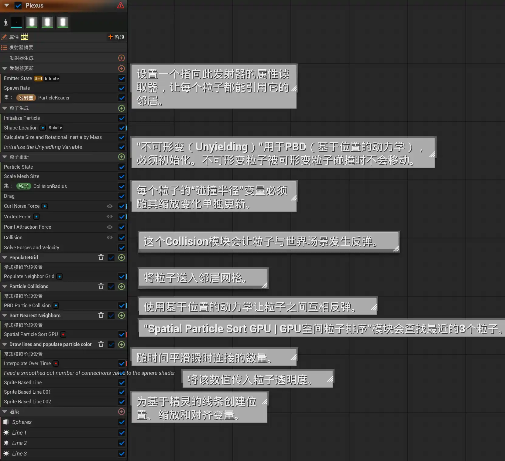

中间的部分只是在定义粒子姿态，上一章提过的模块也不再赘述，这里从 `Spatial Particle Sort GPU` 开始讲起。

### Spatial Particle Sort GPU

#### 功能概述

对最近邻粒子进行排序，找出与目标向量最匹配的前 3 个结果；该方法可用于生成层级结构，并构建逻辑上的最近邻连接关系。

#### 参数介绍

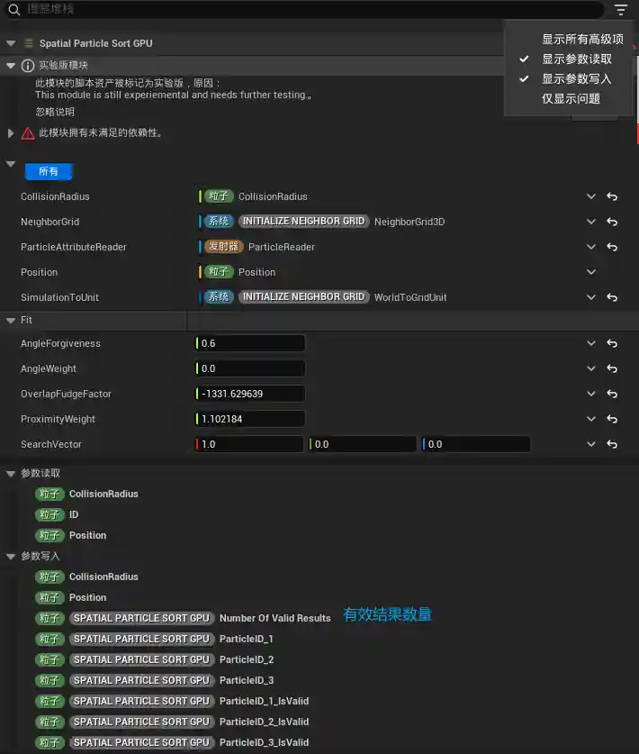

> 别的不说，看*参数写入*，就能明白这里干了什么。

Neighbor Grid 3D 基本信息注册：

都是直接读取之前声明的内容

1. **碰撞半径 | CollisionRadius**
2. **邻居网格 | NeighborGrid**
3. **粒子属性读取器 | ParticleAttributeReader**
4. **位置 | Position**
5. **模拟空间转网格单位 | SimulationToUnit**

匹配逻辑参数 (Fit)：

这部分参数决定了粒子在众多邻居中“挑选”连线对象的偏好：

- **角度容差 | AngleForgiveness**：角度宽容度。数值越大，即便邻居不在 `SearchVector` 的正前方，也越容易被选中。
- **角度权重 | AngleWeight**：评分权重。设为 **0.0**表示完全不考虑方向，只看距离。
- **重叠容差系数 | OverlapFudgeFactor**：连线距离修正。
	- 这里给了一个极小值，说明在这个值的绝对值的范围内都会被记录。用负数是计算逻辑导致的，详情见代码。
- **距离权重 | ProximityWeight**：距离评分的权重。数值越高，系统越倾向于连接距离最近的粒子。
- **搜索方向向量 | SearchVector**：基准方向向量（当前为 X 轴正方向）。如果 `AngleWeight` 大于 0，系统会优先寻找位于该方向上的粒子。

#### 节点概览

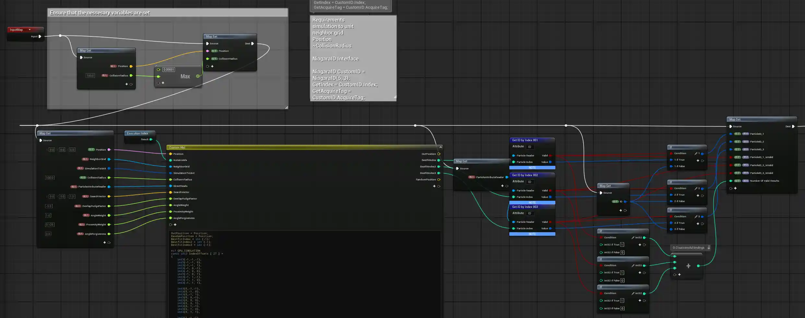

前面避免了碰撞半径为空，后面避免了输出的 ID 为空，重点在中间的代码逻辑部分。

#### 代码解析

关键代码一览：

```C++
/*
 * ============================================================================
 * [功能描述]
 * 对最近邻粒子进行排序，找出与目标搜索方向向量最匹配的前 3 个结果。
 * 该方法常用于生成层级结构，并构建逻辑上的最近邻连接关系。
 * * [输入参数]
 * Position           : 当前粒子的空间位置
 * InstanceIdx        : 当前粒子的实例索引（ID）
 * NeighborGrid       : 邻居网格数据结构接口
 * SimulationToUnit   : 从模拟空间转换到单位网格空间的参数/矩阵
 * CollisionRadius    : 当前粒子的碰撞半径
 * DirectReads        : 用于直接读取其他粒子属性的数据接口
 * SearchVector       : 目标搜索方向向量（用于评估邻居是否在预期方向上）
 * OverlapFudgeFactor : 重叠容差系数（或者说距离容差系数，通常为负，允许粒子之间有一定距离而不必须物理重叠）
 * AngleWeight        : 角度对齐度在最终评分中的权重
 * ProximityWeight    : 距离/重叠度在最终评分中的权重
 * AngleForgiveness   : 角度容差（放宽对完美方向对齐的要求）
 * * [输出参数]
 * OutPosition        : 输出的位置（默认透传当前位置）
 * BestfitIndex       : 匹配度排名第一的粒子索引
 * BestfitIndex2      : 匹配度排名第二的粒子索引
 * BestfitIndex3      : 匹配度排名第三的粒子索引
 * RandomPosition     : 随机位置（当前直接透传当前位置）
 * ============================================================================
 */

OutPosition = Position;     // 初始化输出位置
RandomPosition = Position;  // 初始化随机位置
BestfitIndex = int (-1);    // 第一名索引初始化为 -1 (无效值)
BestfitIndex2 = int (-1);   // 第二名索引初始化为 -1
BestfitIndex3 = int (-1);   // 第三名索引初始化为 -1

#if GPU_SIMULATION

// 定义 27 个网格索引偏移量。
// 涵盖了当前单元格(0,0,0)及其周围所有相邻的 26 个单元格 (3x3x3 的范围)
const int3 IndexOffsets [ 27 ] = 
{
    int3(-1,-1,-1), int3(-1,-1, 0), int3(-1,-1, 1),
    int3(-1, 0,-1), int3(-1, 0, 0), int3(-1, 0, 1),
    int3(-1, 1,-1), int3(-1, 1, 0), int3(-1, 1, 1),

    int3(0,-1,-1),  int3(0,-1, 0),  int3(0,-1, 1),
    int3(0, 0,-1),  int3(0, 0, 0),  int3(0, 0, 1),
    int3(0, 1,-1),  int3(0, 1, 0),  int3(0, 1, 1),

    int3(1,-1,-1),  int3(1,-1, 0),  int3(1,-1, 1),
    int3(1, 0,-1),  int3(1, 0, 0),  int3(1, 0, 1),
    int3(1, 1,-1),  int3(1, 1, 0),  int3(1, 1, 1),
};

float3 UnitPos;
// 将粒子的模拟空间坐标转换为网格的单位空间坐标
NeighborGrid.SimulationToUnit(Position, SimulationToUnit, UnitPos);

int3 Index;
// 根据单位坐标获取当前粒子所在的 3D 网格索引
NeighborGrid.UnitToIndex(UnitPos, Index.x, Index.y, Index.z);

int3 NumCells;
// 获取网格系统的最大单元格数量（用于后续的边界检查）
NeighborGrid.GetNumCells(NumCells.x, NumCells.y, NumCells.z);

int MaxNeighborsPerCell;
// 获取每个单元格内允许存储的最大邻居数量
NeighborGrid.MaxNeighborsPerCell(MaxNeighborsPerCell);

// 初始化前三名的最佳得分，设为极小值以确保能被覆盖
float BestFitScore = -9999.0;   
float BestFitScore2 = -9999.0;  
float BestFitScore3 = -9999.0;  

// 遍历当前单元格及其周围的 27 个相邻单元格
for (int xxx = 0; xxx < 27; ++xxx) 
{
    // 遍历目标单元格内的所有潜在邻居
    for (int i = 0; i < MaxNeighborsPerCell; ++i)
    {
        const int3 IndexToUse = Index + IndexOffsets[xxx]; 
        int NeighborLinearIndex;
        // 将 3D 网格索引转化为 1D 线性索引，方便底层读取
        NeighborGrid.NeighborGridIndexToLinear(IndexToUse.x, IndexToUse.y, IndexToUse.z, i, NeighborLinearIndex);

        int CurrNeighborIdx;
        // 获取当前处理的邻居粒子的实际实例 ID
        NeighborGrid.GetParticleNeighbor(NeighborLinearIndex, CurrNeighborIdx);

        // myBool 是一个临时布尔值，用于捕获直接读取(DirectReads)操作是否返回了有效结果
        bool myBool; 
        float3 OtherPos;
        // 读取邻居粒子的位置信息
        DirectReads.GetVectorByIndex<Attribute="Position">(CurrNeighborIdx, myBool, OtherPos);
        
        // 计算从自身指向邻居粒子的方向向量
        const float3 vectorToOtherFromSelf = OtherPos - Position;
        // 计算两粒子之间的实际距离
        const float dist = length(vectorToOtherFromSelf);
        // 获取归一化后的方向向量
        const float3 normalizedVectorToOtherFromSelf = vectorToOtherFromSelf / dist;

        float OtherRadius;
        // 读取邻居粒子的碰撞半径
        DirectReads.GetFloatByIndex<Attribute="CollisionRadius">(CurrNeighborIdx, myBool, OtherRadius);

        // 计算两粒子的重叠量。如果未发生接触（即距离大于半径之和），该值将为负数。
        float Overlap = (CollisionRadius + OtherRadius) - dist; 

        // 安全与边界检查：
        // 1. 确保读取的网格索引未越界
        // 2. 确保抓取到的邻居不是自身 (CurrNeighborIdx != InstanceIdx)
        // 3. 确保邻居 ID 有效 (CurrNeighborIdx != -1)
        // 4. 确保距离足够大 (dist > 1e-5)，防止除零错误或完全重合的异常情况
        if (IndexToUse.x >= 0 && IndexToUse.x < NumCells.x && 
            IndexToUse.y >= 0 && IndexToUse.y < NumCells.y && 
            IndexToUse.z >= 0 && IndexToUse.z < NumCells.z && 
            CurrNeighborIdx != InstanceIdx && CurrNeighborIdx != -1 && dist > 1e-5)
        {
            // OverlapFudgeFactor（重叠容差）通常为负数。
            // 这里过滤掉距离过远（重叠量小于容差下限）的粒子
            if ( Overlap > OverlapFudgeFactor){
                
                // 计算角度对齐度：邻居方向与目标搜索方向的点积 (结果在 -1 到 1 之间)
                float angleAlignment = float (dot (normalizedVectorToOtherFromSelf, SearchVector));
                
                // 将角度对齐度结合容差进行归一化计算
                float totalAngleAmount = 1.0 + AngleForgiveness;
                float angleFit = angleAlignment + AngleForgiveness;
                angleFit /= totalAngleAmount;
                
                // 计算距离/重叠度的评分，并使用 saturate 将结果钳制在 0 到 1 之间
                float absFudgeFactor = abs(OverlapFudgeFactor);
                float overlapFit = (Overlap + absFudgeFactor) / absFudgeFactor; 
                overlapFit = saturate (overlapFit);
                
                // 计算综合得分：偏向于距离更近（重叠度高）且方向更对齐的粒子
                float currentFitScore = (angleFit * AngleWeight) + (overlapFit * ProximityWeight); 
                
                // 如果当前计算出的得分足以进入前两名
                if ((currentFitScore > BestFitScore) || (currentFitScore > BestFitScore2)){
                    
                    // 无论当前属于第一名还是第二名，原有的第二名都会被挤到第三名的位置。
                    // （第三名的数据在这里可能最终不会被外部使用，但这确保了层级的完整移位）
                    BestFitScore3 = BestFitScore2;
                    BestfitIndex3 = BestfitIndex2;  
                    
                    if (currentFitScore > BestFitScore){
                        // 如果它是最佳匹配（第一名），则将原有的第一名顺延到第二名
                        BestFitScore2 = BestFitScore;
                        BestfitIndex2 = BestfitIndex; 
                        
                        // 更新第一名为当前粒子
                        BestFitScore = currentFitScore;
                        BestfitIndex = CurrNeighborIdx;
                    } else {
                        // 如果它比第二名好，但没有第一名好，则只需更新第二名的数据
                        BestfitIndex2 = CurrNeighborIdx; 
                        BestFitScore2 = currentFitScore;
                    }
                } 
            }
        }      
    }
}

#endif
```

前端初始化部分参见 `PBD` 部分，中点在循环体内部：

##### 1、角度容差 | AngleForgiveness：

```C++
// 计算两粒子的重叠量。如果未发生接触（即距离大于半径之和），该值将为负数。
float Overlap = (CollisionRadius + OtherRadius) - dist; 

// ……

if ( Overlap > OverlapFudgeFactor){ }
```

- 如果 $Overlap > 0$，说明两个粒子碰撞/相交了。
- 如果 $Overlap = 0$，说明刚好挨着。
- 如果 $Overlap < 0$，说明两个粒子之间有缝隙。

> `Overlap` 以正数记录了重叠量，外部参数 `OverlapFudgeFactor` 想要表示距离，自然要使用负数。

##### 2、核心代码：计算距离方向综合得分

```C++
float currentFitScore = (angleFit * AngleWeight) + (overlapFit * ProximityWeight);
```

先来依次看看其中的参数，我们需要计算的只有 `angleFit` 和 `overlapFit`：

1. `angleFit`：角度契合度
2. `AngleWeight`：角度权重，*作为参数输入*，默认为 0 就是不考虑角度因素
3. `overlapFit`：距离契合度
4. `ProximityWeight`：距离权重，*作为参数输入*

2、1、 `angleFit`

第一步：简单点乘计算契合度：`float angleAlignment = float (dot (normalizedVectorToOtherFromSelf, SearchVector));`

第二部：引入角度容差，并归一化：
```C++
float totalAngleAmount = 1.0 + AngleForgiveness;
float angleFit = angleAlignment + AngleForgiveness;
angleFit /= totalAngleAmount;
```

公式：

$$angleFit = \frac{\cos(\theta) + AngleForgiveness}{1 + AngleForgiveness}$$

**逻辑解释**：如果不做处理，正侧面的邻居得分为 0，稍微偏后一点直接变负分。引入 `AngleForgiveness`（假设设为 0.5）后：

- 原本正前方的最高分：$\frac{1 + 0.5}{1.5} = 1$（依旧是满分 1）。
- 原本正侧面的得分：$\frac{0 + 0.5}{1.5} \approx 0.33$（原本是 0 分，现在因为有容差，给了及格分）。
- **作用**：它像是一个“保底分机制”，让你即使没有完美对齐，只要在容差范围内，依然能拿到一个正向的契合度分数。

2、1、 `overlapFit`

第一步：计算 `Overlap`

```C++
float Overlap = (CollisionRadius + OtherRadius) - dist;
// 相交程度 = （当前粒子半径 + 被碰撞粒子半径） - 粒子间距离
```

如前面 角度容差 部分所讲的一样，这里记录了它的相交程度

第二步：基于容差计算原始比例

```C++
float absFudgeFactor = abs(OverlapFudgeFactor);
float overlapFit = (Overlap + absFudgeFactor) / absFudgeFactor;
```

- **公式**：
    $$overlapFit = \frac{Overlap + |OverlapFudgeFactor|}{|OverlapFudgeFactor|}$$

- 参数概述：
	- `overlapFit`：距离契合度
	- `Overlap`：重叠量
	- `OverlapFudgeFactor`：重叠容差系数，*作为参数输入*
- **逻辑解释**：`OverlapFudgeFactor` 通常是一个**负数**（比如 -10），意思是“我允许粒子之间最多有 10 个单位的缝隙，超过 10 就不及格”。
    - 当距离刚好达到极限（$Overlap = -10$）时：$\frac{-10 + 10}{10} = 0$（刚好 0 分）。
    - 当距离处于中间（比如 $Overlap = -5$）时：$\frac{-5 + 10}{10} = 0.5$（得分 0.5）。
    - 当刚好挨着（$Overlap = 0$）时：$\frac{0 + 10}{10} = 1$（满分 1）。

##### 3、简单排序

只需要选出前几名，所以这是一个简单的排序算法，以”打擂台的方式，维持前三名的排序：

```C++
BestfitIndex = int (-1);    // 第一名索引初始化为 -1 (无效值)
BestfitIndex2 = int (-1);   // 第二名索引初始化为 -1
BestfitIndex3 = int (-1);   // 第三名索引初始化为 -1

// 初始化前三名的最佳得分，设为极小值以确保能被覆盖
float BestFitScore = -9999.0;   
float BestFitScore2 = -9999.0;  
float BestFitScore3 = -9999.0;  

// ……

// 如果当前计算出的得分足以进入前两名
if ((currentFitScore > BestFitScore) || (currentFitScore > BestFitScore2)){
	
	// 无论当前属于第一名还是第二名，原有的第二名都会被挤到第三名的位置。
	// （第三名的数据在这里可能最终不会被外部使用，但这确保了层级的完整移位）
	BestFitScore3 = BestFitScore2; // 移动数值
	BestfitIndex3 = BestfitIndex2; // 移动索引
	
	if (currentFitScore > BestFitScore){
		// 如果它是最佳匹配（第一名），则将原有的第一名顺延到第二名
		BestFitScore2 = BestFitScore;
		BestfitIndex2 = BestfitIndex; 
		
		// 更新第一名为当前粒子
		BestFitScore = currentFitScore;
		BestfitIndex = CurrNeighborIdx;
	} else {
		// 如果它比第二名好，但没有第一名好，则只需更新第二名的数据
		BestfitIndex2 = CurrNeighborIdx; 
		BestFitScore2 = currentFitScore;
	}
} 
```

实际上，这里并不会得出精准的第三名：

比如：现有第 1 名成绩为 100 分，第 2 名 90 分，第 3 名 50 分。若某参赛者成绩为 80 分，其分数高于第 3 名，按逻辑应取代原第 3 名，成为新的第 3 名，对吧？

但在第一步，是否进入判断的检查时 `if (80 > 100 || 80 > 90)` 显然条件没有成立，它会被直接跳过。

> 这可能只是为了少做一次判断

### 后续模块简述

其中 Interpolate Over Time 和 Feed a Smoothed out number of connections value to the sphere shader 只是在调整球体的颜色 Alpha，这里不赘述，接下来介绍一下它是如何将获取的**粒子位置数据渲染成连线**的：

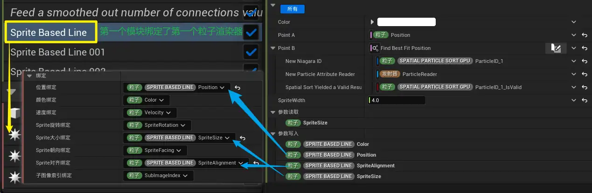

其中的关键就是 `Sprite Based Line` （以粒子为基础的线）

##### 参数介绍
- Color：控制该线条的颜色，通常是一个线性颜色（LinearColor）输入，决定线条精灵的 Tint（着色）。
- PointA：线条起点的世界空间或局部空间坐标
- PointB：线条终点的空间坐标。
- SpriteWidth：控制线条的宽度，即精灵的大小或线条的厚度，决定视觉粗细。

其输出参数中有 `SpriteAlignment`，可以获取从B指向A的向量

## Structural Support | 结构支撑

一个多阶段发射器和基于支撑树结构的支撑关系的 Niagara 实现。

<video width="100%" height="auto" controls loop autoplay muted>  <source src="/posts/虚幻内容示例：Niagara临近网格效果拆解（下）/Structural%20Support_small.mp4" type="video/mp4">  您的浏览器不支持 HTML5 视频播放。</video>


### 发射器概览

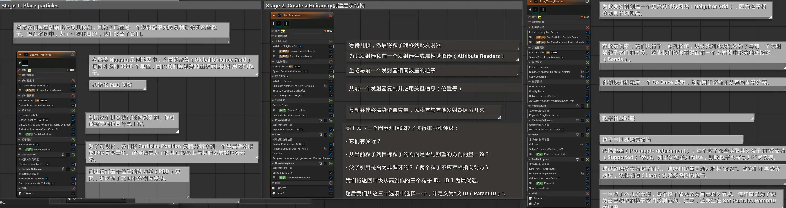

这里提供了三个发射器，这体现了一种 **粒子属性阅读器** 的使用思路：一个发射器计算位置，另一个发射器渲染粒子，并执行后续逻辑。

> 正如示例注释所说：在此示例中，我们先放置粒子并将它们从彼此的体积中分离；随后创建一个支撑结构，并将其传递给第三个也是最后一个运行时发射器。该发射器受益于之前运行的所有预处理任务，而无需承担这些任务带来的复杂性累积。

### Emitter1：创建粒子

第一个发射器，做的事情很简单：在指定范围内创建粒子，并让他们之间不重叠：使用 `Shape Location (Box)` 在一定范围内撒点，再使用 `PBD Particle Collision` 将重叠的部分偏移开

> Calculate Accurate Velocity：根据上一帧位置与当前位置计算精确速度，不知道为什么会出现在这里……

### Emitter2：创建层次结构

这个发射器的目的很简单：从 Emitter1 中复制发射器相关数据，并简历一个层级结构。具体来说：

#### 创建属性读取器

这里直接创建了两个属性读取器：一个读取自身，一个读取 Emitter1。这是获取其他粒子信息的关键部分（理论上吧，因为复制粒子信息的时候，它实际上使用了一个新建的粒子属性读取器，那是相关模块的默认值）

#### 复制粒子属性

使用 `Duplicate Another Emitters Particles` 将 Emitter1 的相关属性复制到自身，以获取相同的位置、索引等属性。

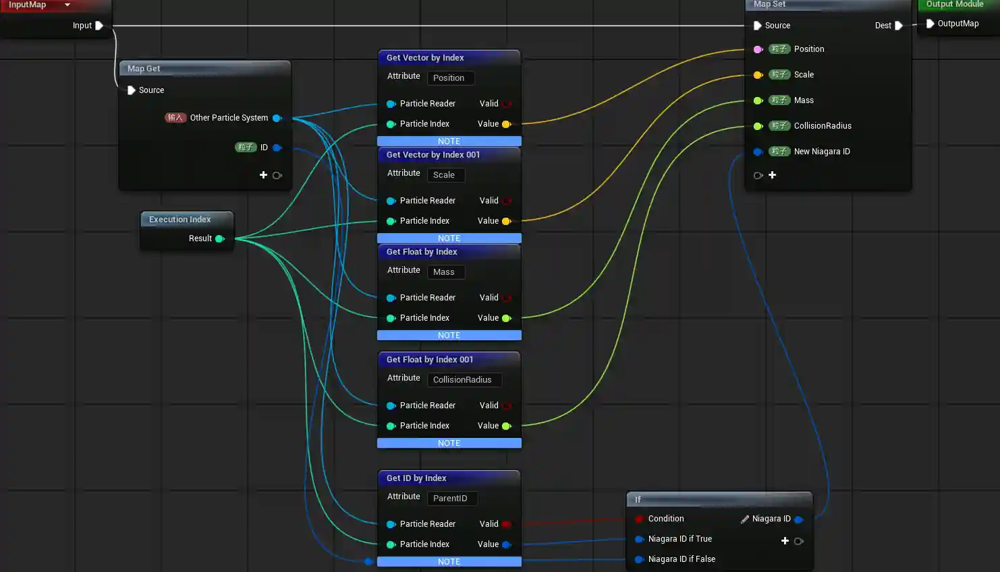

加上生成时间被延时了0.5s（在系统属性中），这让它的粒子之间生成在了迭代后的、没有粒子重合的位置上。

#### 初始化支撑结构

- Initialize Support Variables | 初始化支撑变量：让低于一定高度的粒子成为”支撑”（不会被激活）
- Visualize ground support | 可视化支撑地面：让这些粒子变成绿色

这个支撑在下一个发射器会很有用

---

略过中间的模块，都是非关键或者重复的部分，让我们直接学习它如何建立这样一个层级关系，也就是常规模拟阶段 `Sort` （排序）

---

#### 找到父ID

`父ID` 需要符合一些条件：

1. 距离够近
2. 在期望的方向上（比如父ID应该在子粒子下方）
3. 父ID与子ID 不循环引用（两个粒子不应互相指向对方）

足够近和指定方向，使用 `Spatial Particle Sort GPU` 即可

#### 排除循环引用

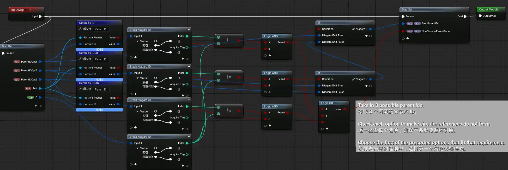

简单来说就是：

如果排序为1的粒子和自己的ID不同，输出1
如果排序为2的粒子和自己的ID不同，输出2
如果排序为3的粒子和自己的ID不同，输出3
都相同就输出没找到

#### Do Once：只执行一次

该模块会记录其**触发条件**在**之前的帧中是否曾经成立**。

- 如果**从未成立**，模块的 **Execute** 属性返回 **true**。
- 如果在**之前某一帧**已经返回过 true，则后续返回 **false**。

你可以使用任何可被判定为真或假的表达式来设置**触发条件**。

例如，当数值比较判断出 **X 大于 Y** 时，用户可令其返回 true。

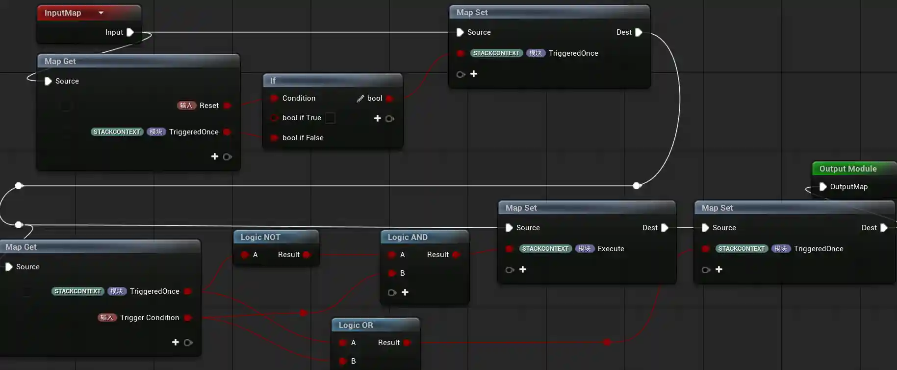

这个模块的实现依赖一个命名空间：

> STACKCONTEXT | 堆栈上下文：可以写入到任意模块，或从中进行读取的值。
> 
> StackContext 值在帧与帧之间、或在阶段之间将保持不变。

**保持不变**这个特性，让他可以在一帧中，在不同粒子之间传递信息，比如是否多次执行

这里的实现逻辑是：

##### 1. “重置”逻辑（图上半部分）

在逻辑开始前，它先检查是否需要清除记忆：

- **节点：** `If (Condition: Reset)`
- **原理：** * 如果 `Reset` 为 `True`，则输出一个 `False` 给 `TriggeredOnce`。
    - 相当于**按下抹除键**，强行把“已触发”的状态改回“未触发”。

##### 2. “过滤”逻辑（图下半部分中间）

这是决定这一帧是否输出“执行信号”的关键：

- **节点：** `Logic NOT` + `Logic AND`
- **公式：** `Execute = (NOT TriggeredOnce) AND (Trigger Condition)`
- **通俗解释：** 只有当 **“之前还没触发过”** 并且 **“现在满足触发条件”** 时，才会输出 `Execute = True`。
- **结果：** 一旦第一帧触发了，`TriggeredOnce` 变为了 `True`，那么 `NOT TriggeredOnce` 就会变成 `False`，导致后续无论 `Trigger Condition` 如何，`AND` 节点永远只返回 `False`。

##### 3. “锁定”逻辑（图右下角）

这是为了确保“记忆”被更新并锁死：

- **节点：** `Logic OR`
- **公式：** `New TriggeredOnce = (Old TriggeredOnce) OR (Trigger Condition)`
- **通俗解释：** 只要“以前触发过”或者“现在正在触发”，`TriggeredOnce` 就会保持为 `True`。
- **结果：** 这是一个**自锁机制**。一旦变成 `True`，就像开关跳闸了一样，除非前面的 `Reset` 信号进来，否则它永远回不去 `False`。

#### 在第一帧设置参数映射属性

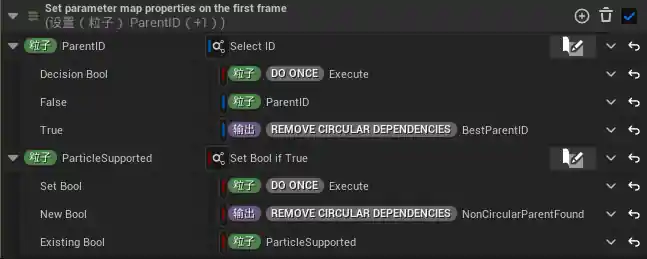

使用了 `Execute` 这个变量确保只在第一帧执行。

Select ID 这个定义输入不必多说，Set Bool if True 看着奇怪其实也差不多：

- Set Bool = true：使用 New Bool，这里是是否没有找到父项的布尔
- Set Bool = false：使用 Existing Bool，这里是“粒子已被支撑”变量原始变量，默认为false

### Emitter3：应用动画效果

如开头的视频所见，会随机断掉一个支撑，并让其所有被支撑的物体一同掉落。

#### 复制约束

这里除了像上一个发射器一样复制了基本信息，还复制了 `ParticleSupported` (粒子被约束) 这个特殊变量

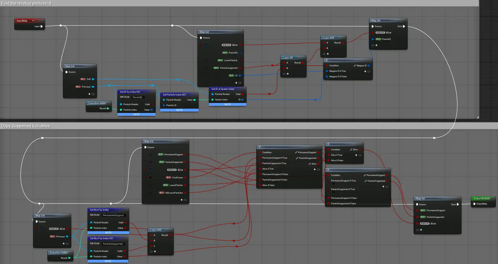

上面一半，获取了对应的粒子 ID ，下半部分，获取了正确的支撑属性

#### 随时间随机激活粒子

本质是一个 `Do Once` 模块，具体逻辑是：

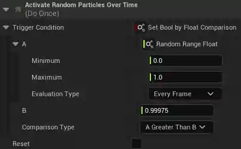

每帧获取一个 [0, 1] 的随机值，如果大于 0.99975，就激活。数据通过 TriggeredOnce 传递，用以传播父级状态，直接作用在 **None 阶段的 ParticleSupported** 中，接下来就讲解他。

#### 具体激活逻辑

中间的内容基本就是处理环境碰撞，直接看 **None 阶段的 ParticleSupported** 模块：

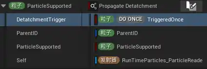

> 这个动态输入部分可以说是这个整个逻辑的重点。

它通过一个自定义动态输入，配置 “`ParticleSupported`”（粒子被支撑）这个布尔变量。显然，当它为 false 的时候，粒子会失去支撑，并掉落。它的具体逻辑如下：

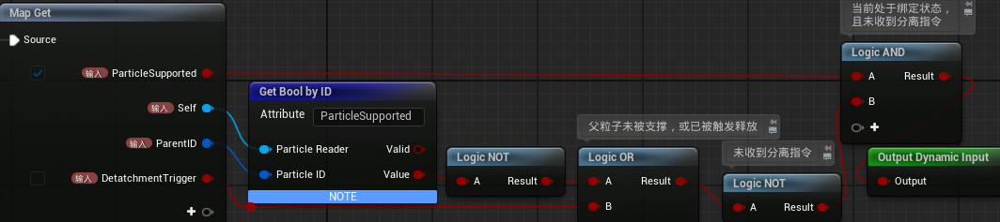

保持支撑需要满足以下条件：

1. **自身被支撑**：`ParticleSupported` 变量为 true
2. **父粒子被支撑**：Parent 的 `ParticleSupported` 为 true
3. **没有被激活**：自身的 `DetatchmentTrigger` 为 false

一旦其中一个没有满足， 就会导致 `ParticleSupported` 变为 false。

#### 激活后如何处理

现在，假设 `ParticleSupported` 已经被配置为 false，会发生什么：

在 `Lerp Particle Attributes` 模块中，它被配置成了切换状态用的变量：一旦不被支撑，粒子会切换以下属性：

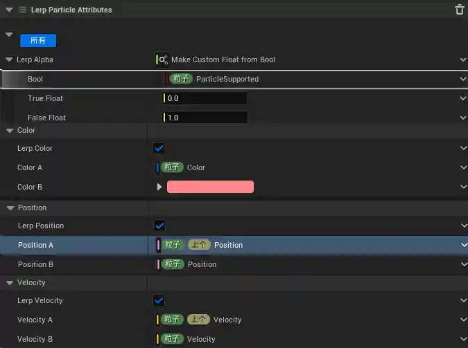

- 颜色
- 位置
- 速度

让这些属性可以被正常计算，也就形成了“激活”的表现。

#### ParentID

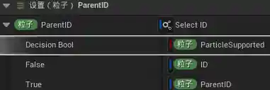

这个模块只负责一个功能：在粒子不被支撑的时候，将父ID配置为自己，避免继续渲染连线。

## Boids | 鸟群模拟

<video width="100%" height="auto" controls loop autoplay muted>  <source src="/posts/虚幻内容示例：Niagara临近网格效果拆解（下）/Out_no_audio.mp4" type="video/mp4">  您的浏览器不支持 HTML5 视频播放。</video>

在虚幻中使用 Niagara 实现的鸟群效果。本节将简单介绍鸟群算法，并阐述虚幻对鸟群行为的扩展实现。


### 基础鸟群算法

经典的 Boids 算法由 Craig Reynolds 于 1986 年提出，通过三条简单规则模拟群体行为：

| 规则 | 英文名     | 描述                                   |
| ---- | ---------- | -------------------------------------- |
| 分离 | Separation | 与邻近个体保持一定距离，避免拥挤碰撞   |
| 对齐 | Alignment  | 与邻近个体的飞行方向趋同               |
| 聚合 | Cohesion   | 向邻近个体的平均位置移动，保持群体聚集 |

虚幻内容实例在这个基础上扩展了一些内容：
既然你在深入研究 Niagara 中的群体仿真，将这些逻辑模块化确实能让粒子行为更具“生物感”。以下是按照你的要求整理的列表：

### 虚幻内容示例对鸟群算法的优化

* **Avoid the Environment | 环境避让**
  * 增加对场景碰撞体（墙壁、地形、静态网格）的感知与避让行为。
* **Form Clusters | 动态聚类**
  * 基于距离阈值的动态子群体形成机制。
* **Boid Proximity Avoidance | 近距离避让**
  * 分离规则的紧急程度分层处理。
* **Match Velocity | 速度匹配**
  * 与邻近鸟群成员的速度趋同行为。
* **Avoid Head-on Collisions | 避免正面碰撞**
  * 预测未来轨迹冲突，提前进行避让。

### 发射器概览
