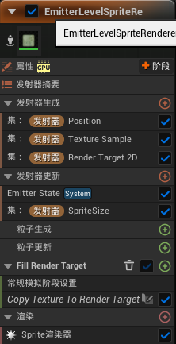
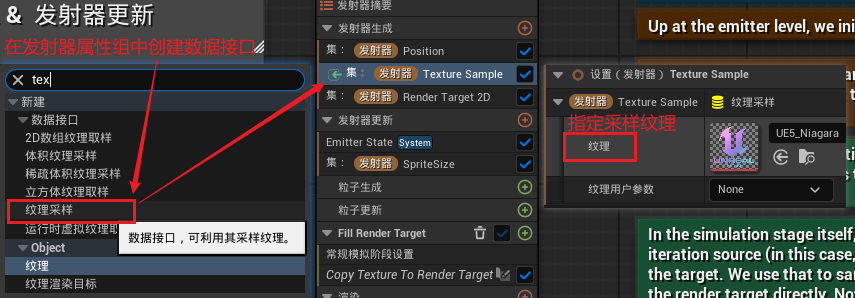
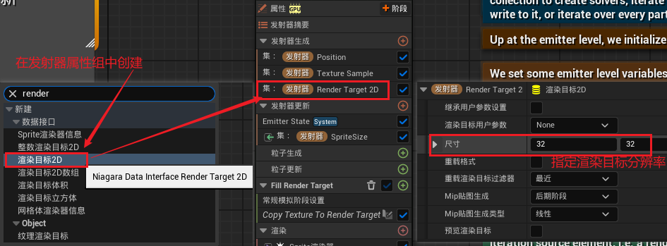
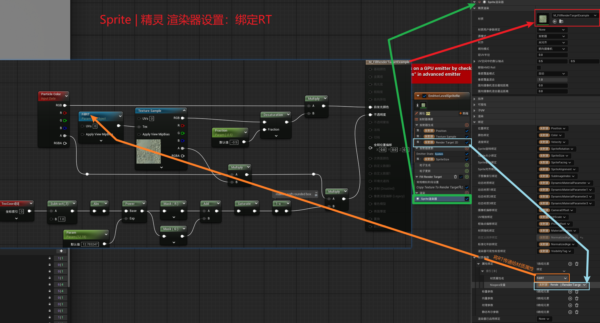
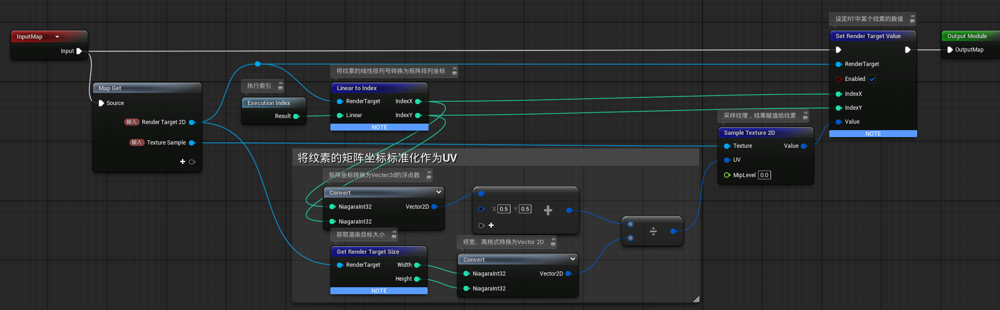
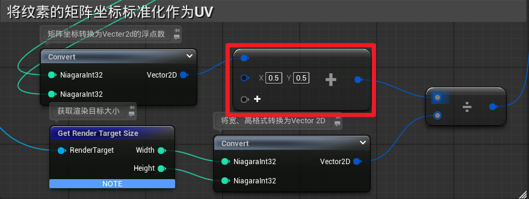
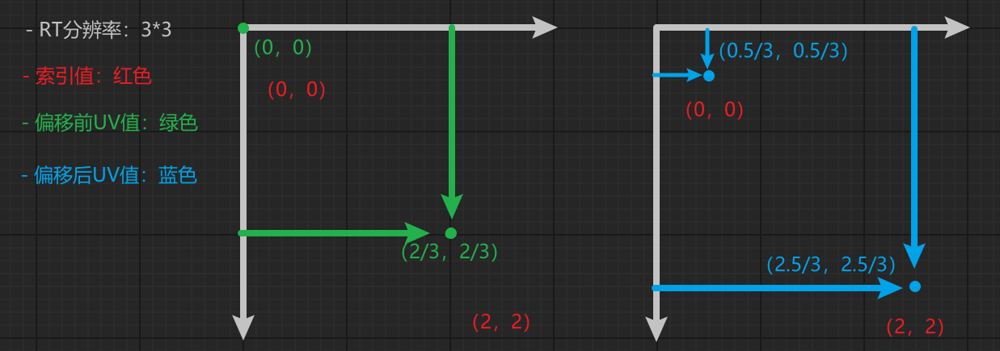
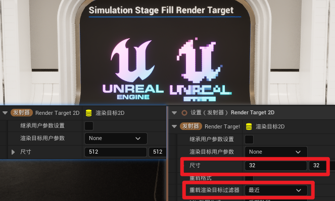

# 概述

这是 Niagara 系统模拟阶段的入门示例

## 关于模拟阶段
- 模拟阶段类似于“单帧内的粒子更新迭代”。
- 模拟阶段不仅可以处理粒子，还可以处理特定的数据接口。
- 模拟阶段是一个基本功能，因此你如何使用它才是关键。

## 阅读内容
- 粒子名称：FIllRenderTarget
- 父地图：`/All/Game/Map/VFX/Niagara_Advanced_Particles`
- 储存位置：`/All/Game/ExampleContent/Niagara/Grid2D`

# 自带注释整理

> ## 启用模拟阶段
> 
> 在GPU粒子发射器中启用模拟阶段：于高级发射器属性中勾选"启用模拟阶段（Enable Simulation Stages）"
> 
> 注意：新版本中为，点击粒子上的添加阶段按钮，选择**添加模拟阶段**

## 【技术解读】

模拟阶段可视为类似粒子更新（Particle Update）的附加逻辑堆栈。其核心差异在于支持迭代机制——即单帧内对容器内所有元素执行多次运算，类似于堆栈中的"For循环"结构。

> 即：一帧中进行多次计算 / 单帧内的粒子更新迭代

## 【架构特性】

该系统的独特性体现在"迭代源（Iteration source）"的多样性。模拟阶段不仅可遍历粒子，还能：

*   对2D网格集合（Grid 2D Collection）的每个单元格进行流体解算
*   遍历渲染目标（Render Target）的每个像素进行直接写入
*   执行标准粒子迭代

## 【工程实践】

1.  ​**​发射器层级配置​**​
    *   初始化：
        *   渲染目标
        *   纹理采样器（Texture Sample）
    *   设置精灵（Sprite）属性变量（因精灵渲染器源模式设为"发射器"，故无需实际粒子）
2.  ​**​模拟阶段设置​**​
    *   选择渲染目标作为迭代源 → 该阶段将对每个**纹素**（Texel）执行直接运算，并作用于他。
    *   核心逻辑构建：
        *   通过将迭代索引（Exec Index，此处对应渲染目标单元）除以目标尺寸生成UV坐标
        *   基于此UV进行纹理采样
        *   调用渲染目标填充函数（直接操作显存）
3.  ​**​材质参数绑定​**​
    *   在精灵材质中创建命名纹理对象参数（如示例中的"Fill RT"）
    *   在精灵渲染器（Sprite Renderer）的"材质参数绑定（Material Parameter Bindings）"数组中：
        *   选择已命名的参数
        *   关联配置的渲染目标

## 【系统联动】

此配置实现渲染目标数据直通至精灵渲染器的管线级优化，建立高效的GPU端闭环处理流程。

# 重要知识点

## 一、Texture Sample：纹理采样变量

用于采样纹理的数据接口，通过指定 `纹理` 参数，可以选择被采样的纹理。

## 二、RT 与 材质参数绑定
**创建 `RT(Render Target 2D | 渲染目标2D)`** ：

- 通过编辑 `sizi | 尺寸` 参数，指定渲染目标的分辨率

> 注意：
> 1. 关于分辨率：渲染目标的分辨率应当为 2 的次方倍，如512、256、1024。
> 2. 关于属性绑定：只能作用于发射器活系统属性，无法替代 *动态材质参数* 或 *材质参数集*

**绑定材质属性**：

在 `ScratchModule` 模块中，将 **采样结果** 传递给RT，这里通过 **属性绑定** 将RT传递给材质。

## 三、ScratchModule 脚本
作用：将 `Texture Sample` 采样内容传递到 `Render Target 2D` 上

###　`Execution Index | 执行索引` 节点介绍
因为：
- 会把模组放到模拟阶段中
- 且迭代源会选择Render Target 2D
所以：
- RT的每个纹素都会执行这个脚本

但是它们不是同时执行，而是依次执行

这个执行索引代表了纹素在执行队伍中的序号，正好等于纹素的线性排列号

### 为什么要 `＋0.5`

这里对UV进行偏移

接下来通过一个案例进行说明：

设：RT分辨率为：3*3

- 偏移前，采样位置偏左上
- 偏移后，采样位置在图片中心，采样结果更合理

# 应用示例

## 像素化采样结果

将 `RT分辨率` 从512更改为32，同时修改 `目标过滤器` 为 **最近** 即可

# 引用链接

- 很棒的分析视频：[UE5.1_Niagara高级1.1.2 _Cus_SampleTextureToRenderTarget2D](https://www.bilibili.com/video/BV1KV4y1Q76p)
- 相关文档，介绍了更深入的内容：[Niagara Advanced Guide – Basics of the Simulation Stage](https://heyyocg.link/en/ue4-26-niagara-adavanced-simulation-stage-basic/)

## 虚幻内容示例
- 虚幻内容示例官方文档：[内容示例](https://dev.epicgames.com/documentation/zh-cn/unreal-engine/content-examples-sample-project-for-unreal-engine)
- Fab下载页面：[Content Examples](https://www.fab.com/listings/4d251261-d98c-48e2-baee-8f4e47c67091)