> unreal版本：5.5.4

# 概述

在虚幻编辑器中使用的脚本工具，帮助执行一些重复性操作，比如批量重命名，批量更改材质实例。

这里会记录最基础的启用和创建，同时记录了六个使用案例：
1. 批量替换场景中的模型
2. 批量替换场景中模型的材质
3. 批量修改世界大纲中的actor命名
4. 切换语言按钮

# 启用插件

在新版本中，以下插件应当都是默认开启的状态：

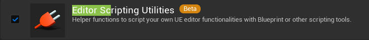

低版本（4.0）还需要在 `编辑器偏好设置 - 实验性功能 - 工具 - Editor Utility Blueprints (Blutility)` 上打勾。

# **创建**编辑器蓝图 与 常用蓝图**介绍**

> 这些本质都是蓝图功能，继承于Object，所以这些东西都可以在创建蓝图类的更多选项中，通过搜索名称进行创建。

右键内容管理器，创建编辑器工具：

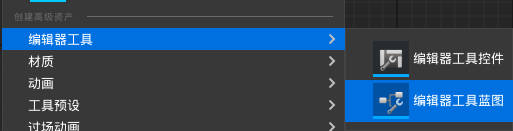

在可以创建的类中，常用的有以下几种：

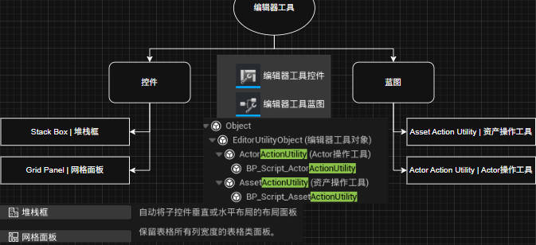

## 常见父类介绍
- 控件：带图形界面的编辑器工具，运行后会显示我们创建的图形界面。
- 蓝图：不带图形界面的编辑器工具，可以注册到右键菜单中进行使用。

## 蓝图工具

上图提到的两个蓝图类型都注册到了不同窗口的右键菜单中。

- Asset Action Utility | 资产操作工具：
  - 功能：对 ***内容文件夹中的*** 资产进行操作，比如批量重命名、更改母材质等等。
  - 使用：在资源管理器中右键被选中的资产，选择“**脚本化资产行为**”。
- Actor Action Utility | Actor操作工具：
  - 功能：对放置到 ***关卡中的*** Actor进行操作，比如批量重命名、更改母材质等等。
  - 使用：对关卡中被选中的物体进行右键，选择选择“**脚本化资产行为**”。

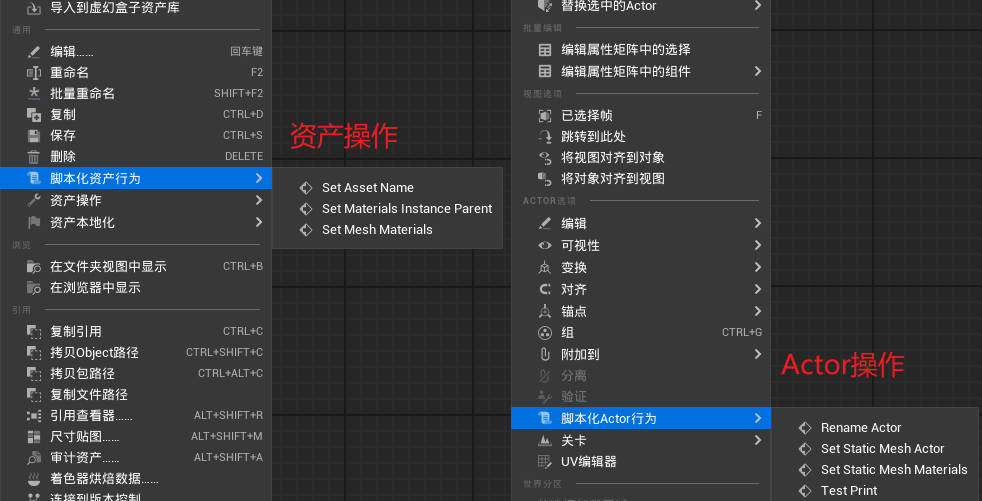

> 不知道为什么，这个版本中，创建蓝图工具时，Actor Action Utility不在默认常用创建窗口中。
>
> 但这些内容都是蓝图，可以在创建蓝图中，通过搜索获得。
# 几个基本功能的实现
这些功能的编写都是创建对应名称的函数即可。
## 示例功能：打印Hello

在 `ActorActionUtility` 中，创建一个名为TestPrint的函数

添加打印节点，并编译、保存：

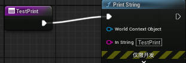

在场景中右键，选择TestPrint运行后，会出现如下打印字符串：

## 1、批量替换场景中的模型

父类：Actor Action Utility

这其实是一个虚幻引擎本身就有的功能，这里重新实现一下。

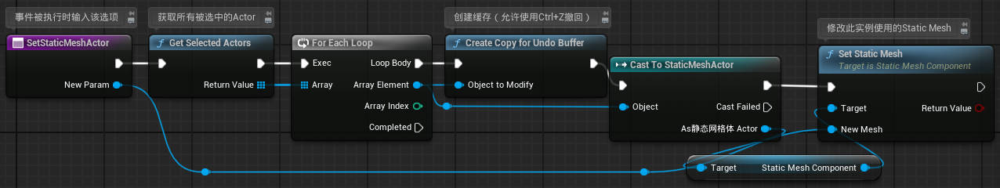

## 2、批量替换模型材质

父类：Actor Action Utility

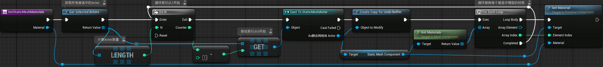

## 3、批量重命名

父类：Actor Action Utility

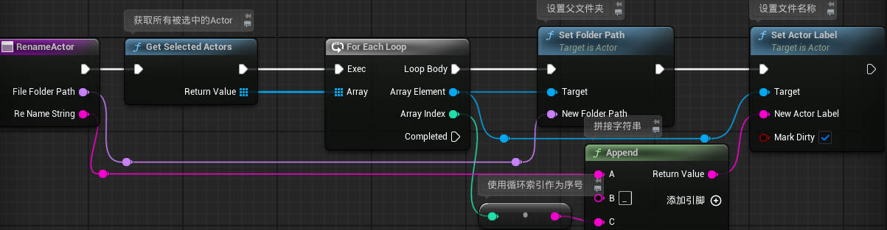

## 4、切换语言按钮

父类：编辑器控件：Stack Box | 堆栈框

控件蓝图需要UI相关知识，对控件进行编辑；这里只是简单添加一个按钮和文本，并将文本设置为变量。

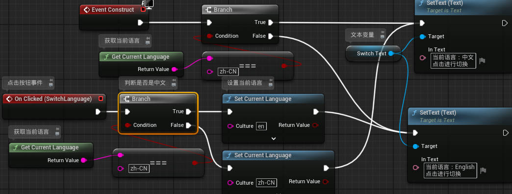

运行编辑器控件：
- 内容管理器中的控件，选择“**运行编辑器控件工具**”。
- 在蓝图中，点击左上角的**运行工具控件**。

---
# 重要知识点

## 1、CreatCopyForUndoBuffer节点：允许撤销

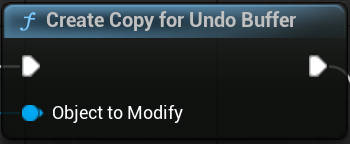

- CreatCopyForUndoBuffer：创建撤消缓冲区的副本
- 目的：允许`Ctrl+Z`等**撤销**操作生效，如果没有这个节点或不正确设置，将无法撤销

## 2、循环索引与数组索引

出现在：**2、批量替换模型材质**中。

- `DoN`节点的索引输出，从“1”开始递增
- `Get a copy`节点使用的索引，从“0”开始表示第一个变量
- 所以使用时需要对`DoN`节点的索引输出进行“减一”操作后，才能正确读取数组的第一个变量。

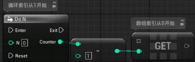